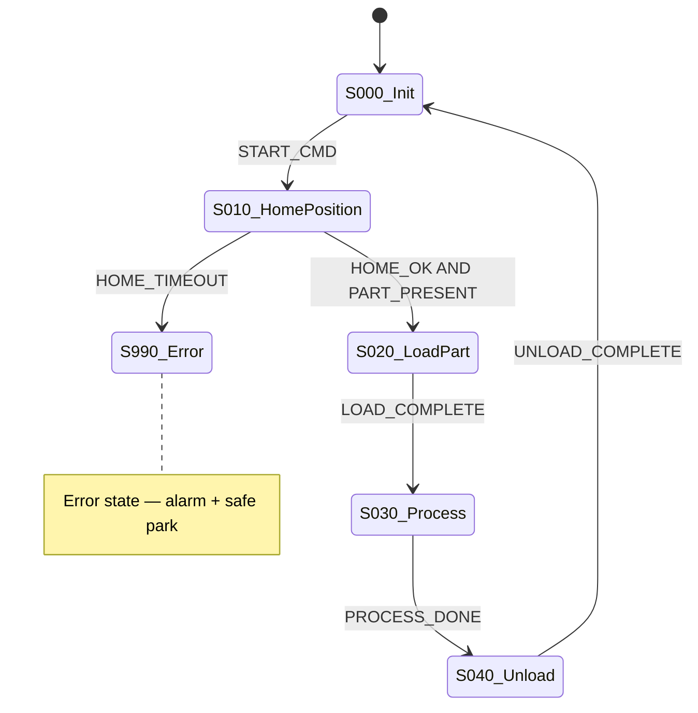

# MDSCHEMA_RAWDATA_03_FLOWCHART.md — Flowchart Specification

> **This file defines how the project's "03 — Flowchart" raw data file should be structured.** Documents the machine's step-by-step sequential behavior, transition conditions, and parallel branches. The data-pack representation of IEC 61131-3 Sequential Function Chart (SFC) logic.

---

## 1. What Does This File Define?

This is **a "schema"** — the actual flowchart in the project (`RD03_Flowchart.xlsx` / `.md`) must conform to this spec.

- ✅ Structure of each step and its mandatory fields
- ✅ Transition condition format
- ✅ Parallel branch and alternative sequence representation
- ✅ Mermaid stateDiagram output format (visualization in MD)
- ✅ Alignment with ISA-88 procedural hierarchy (procedure → operation → phase → step)

**This file is NOT:**
- ❌ The actual SFC code (that runs on the PLC)
- ❌ Mode-change logic (that's RD04 Mode — auto/manual transitions)
- ❌ Timing detail (that's RD07 Timing — timer values within a step)
- ❌ Alarm and fault handling (that's RD08 Alarm — behavior after step error)

---

## 2. When Is It Generated, Where Does It Come From?

| Type | Source | Producer | Validator |
|---|---|---|---|
| **Retrofit** | Legacy OB/FB sequence code + existing flowchart (if any) + field walkdown | AI (`PROMPT_EXTRACT_FLOWCHART_FROM_CODE.md`) then human correction | `script_consistency_check.py` |
| **Greenfield** | Customer brief + machine spec + P&ID | Human (guided by `GREENFIELD_DESIGN_FLOWCHART.md`) | `script_consistency_check.py` |

Pipeline placement: **Gate 2** → **Gate 3** → **Gate 4** (GREEN). Works with RD04 Mode: determines which steps run inside which modes.

---

## 3. Excel Column Definition (Required)

`RD03_Flowchart.xlsx` must contain the following columns **in this order**:

| # | Column | Type | Required | Enum / Regex | Description |
|---|---|---|---|---|---|
| 1 | `StepID` | string | ✅ | `^S\d{3}$` or `^S\d{3}[A-Z]$` | Step identifier (e.g., `S000` initial, `S010`, `S010A` parallel branch) |
| 2 | `StepName` | string | ✅ | min 3 characters, EN | Short English name of the step (used in code generation) |
| 3 | `StepType` | enum | ✅ | `Initial`, `Normal`, `Alternative`, `Parallel`, `Final` | ISA-88 step types |
| 4 | `Description` | string | ✅ | min 5 characters | What happens in this step (actions, time estimate) |
| 5 | `EntryCondition` | string | ✅ | (free — boolean expression) | Condition to enter this step (transition from prior step). For `S000` use `TRUE` |
| 6 | `ExitCondition` | string | ✅ | (free — boolean expression) | Condition to leave this step (transition to next step). `AND` / `OR` / tag names |
| 7 | `Actions` | string | ✅ | (free — comma-separated) | Actions performed in this step (set/reset tag, call FB) |
| 8 | `NextStep` | string | ✅ | `S\d{3}[A-Z]?` or `ERROR` or `END` | Target step on normal transition |
| 9 | `ErrorStep` | string | ⚪ | `S\d{3}[A-Z]?` or `ERROR` | Step to go to on error |
| 10 | `TimerRef` | string | ⚪ | (free) | Timer IDs used in this step (cross-reference to RD07 TimerID) |
| 11 | `ModeReq` | string | ⚪ | (free) | Which operating mode the step is active in (cross-reference to RD04 ModeID) |
| 12 | `ISA88Level` | enum | ⚪ | `Procedure`, `Operation`, `Phase`, `Step` | ISA-88 procedural hierarchy level |
| 13 | `Notes` | string | ⚪ | (free) | Edge case, safety note, operator note |
| 14 | `Status` | enum | ✅ | `Active`, `Inactive`, `Draft` | `Draft` = step not yet approved. Renamed to English (2026-06-10); legacy Turkish literals (`Aktif`/`Pasif`/`Taslak`/`Yedek`) in existing projects remain readable by the tooling |

### 3.1 Column Descriptions (Detail)

**StepID (1):** `S000` must be the starting step (Initial). Incrementing by 10 is recommended (`S010`, `S020`) to ease later insertions. Parallel branches: `S030A`, `S030B`. Convention `S999` or `S990` for the related error step.

**StepType (3):**
- `Initial` → the single step where the sequence begins (double line in SFC)
- `Normal` → standard step
- `Alternative` → IF-ELSE branching (only one runs)
- `Parallel` → AND branching (all run at the same time)
- `Final` → sequence-completion step

**EntryCondition / ExitCondition (5-6):** Boolean expression format. Tag names allowed (consistent with RD01 Tag column). Examples:
- `MOT_CV01_001_FDBK AND NOT SEN_DOOR_001_CLOSED` → motor feedback and door not closed
- `T#5s` → after 5 seconds (used together with TimerRef)
- `TRUE` → unconditional transition

**Actions (7):** Each action separated by a comma. Examples:
- `SET MOT_CV01_001_DRIVE` → set output
- `RESET VLV_INLET_002` → reset output
- `CALL FB_Motor(DB_Motor_Pump01)` → FB call
- `START Timer_Step010` → start timer (RD07 TimerRef)

**ISA88Level (12):** ISA-88 §4 procedural model. For hierarchy management in large systems. May be left blank in small systems.

---

## 4. JSON Schema (Validation)

`08_METADATA_INPUT/schema/rd03_flowchart.schema.json`:

```json
{
  "$schema": "https://json-schema.org/draft/2020-12/schema",
  "title": "RD03 — Flowchart",
  "type": "array",
  "items": {
    "type": "object",
    "required": ["StepID", "StepName", "StepType", "Description", "EntryCondition", "ExitCondition", "Actions", "NextStep", "Status"],
    "additionalProperties": false,
    "properties": {
      "StepID":         { "type": "string", "pattern": "^S\\d{3}[A-Z]?$" },
      "StepName":       { "type": "string", "minLength": 3 },
      "StepType":       { "enum": ["Initial","Normal","Alternative","Parallel","Final"] },
      "Description":    { "type": "string", "minLength": 5 },
      "EntryCondition": { "type": "string", "minLength": 1 },
      "ExitCondition":  { "type": "string", "minLength": 1 },
      "Actions":        { "type": "string", "minLength": 1 },
      "NextStep":       { "type": "string", "pattern": "^(S\\d{3}[A-Z]?|ERROR|END)$" },
      "ErrorStep":      { "type": "string", "pattern": "^(S\\d{3}[A-Z]?|ERROR)$" },
      "TimerRef":       { "type": "string" },
      "ModeReq":        { "type": "string" },
      "ISA88Level":     { "enum": ["Procedure","Operation","Phase","Step"] },
      "Notes":          { "type": "string" },
      "Status":         { "enum": ["Active","Inactive","Draft"] }
    },
    "allOf": [
      {
        "if":   { "properties": { "StepType": { "const": "Initial" } } },
        "then": { "properties": { "EntryCondition": { "const": "TRUE" } } }
      }
    ]
  }
}
```

**Conditional rule:** an `Initial` step must have `EntryCondition` = `TRUE` (the initial step is unconditionally active).

---

## 5. MD Output Format

`RD03_Flowchart.md` produced at Gate 4 has two sections: table + Mermaid diagram.

````markdown
---
title: RD03 — Flowchart
project: <project_name>
generated: YYYY-MM-DD
source: RD03_Flowchart.xlsx
filter: Status=Active
total_steps: <N>
schema: RD03
---

# RD03 — Flowchart (Active Steps)

## Step Table

| StepID | StepName | StepType | Description | EntryCondition | ExitCondition | NextStep |
|--------|----------|----------|-------------|----------------|---------------|----------|
| S000 | Init | Initial | System initial state | TRUE | START_CMD | S010 |
| ... | ... | ... | ... | ... | ... | ... |

## Sequence Diagram (Mermaid)


````

---

## 6. AI Filling Instructions (Retrofit)

AI fills this file via `PROMPT_EXTRACT_FLOWCHART_FROM_CODE.md`:

```
INPUT: _parsed.md Section 6 (OB), 7 (FB), 10 (Call Tree)
TASK:
  1. Identify OB1 (main cycle) + sequence FBs
  2. Turn each CASE/IF-THEN-ELSE block into a separate step row
  3. Write timer conditions into ExitCondition, put the timer name into TimerRef
  4. Show parallel branching as StepType=Parallel + separate StepIDs (010A/010B)
  5. Write error/exception paths into the ErrorStep column (S990 convention)
  6. Pull legacy comment lines into Description (preserve German/Turkish, add the original)
  7. Leave ISA-88 level blank if unknown — usually undefined in legacy code
  8. Generate a Mermaid diagram (per the MD output format)
```

---

## 7. AI Filling Instructions (Greenfield)

```
INPUT: _input/brief.md + P&ID + ISA-88 recipe (if any)
TASK:
  1. Extract the main operation steps from the brief
  2. Layer them per the ISA-88 hierarchy (Procedure/Operation/Phase/Step)
  3. Define entry/exit conditions per step using signals (with RD01 tags)
  4. Design a safe "error" path for each step (S990+ convention)
  5. For timer conditions, set TimerRef cross-referencing RD07
  6. Steps awaiting approval get Status=Draft (draft)
```

---

## 8. Industry Standards Reference

| Standard | How Applied in This Spec |
|---|---|
| **IEC 61131-3 SFC** | Step/Transition/Action concepts — StepID, EntryCondition, ExitCondition, Actions columns |
| **ISA-88 §4** | Procedural hierarchy (Procedure/Operation/Phase/Step) — ISA88Level column |
| **IEC 61512-1** | Batch control — IEC counterpart of ISA-88 |
| **IEC 61511** | SIS safety instrumented system — ErrorStep column (safety transitions) |

---

## 9. Typical AI Errors (Lessons Learned)

### 9.1 Syntax (Category A) — Auto-detectable
- Wrong StepID format (`Step01` instead of `S010`) → regex reject
- NextStep `S1` (not 3 digits) → regex reject
- ExitCondition empty string → minLength reject

### 9.2 Schema/Standard (Category B) — Validator catches
- An Initial step with EntryCondition ≠ `TRUE` → conditional rule reject
- Two rows with the same StepID → uniqueness reject
- `Parallel` step pointing to a single NextStep → logical violation (parallel branches need multiple targets; reviewer catches)

### 9.3 Semantic (Category C) — Manual review required
- ⚠️ AI looks at the legacy `IF` chain and infers a linear sequence — but the real machine may run in parallel → P&ID + field walkdown verification required
- ⚠️ Error path (`ErrorStep`) not designed per step → `S990` link looks optional; reviewer must catch this omission
- ⚠️ Timer conditions written as a literal duration (`5000ms`) in ExitCondition — instead use `TimerRef=TMR_Step010` and cross-reference RD07
- ⚠️ `Alternative` and `Parallel` types confused — these are fundamentally different SFC constructs: Alternative = either-or, Parallel = both at the same time
- ⚠️ Special characters (Turkish/German) in Mermaid labels can break rendering → state names in EN, descriptions in a separate column

### 9.4 Correction Request Template

> "Error in RD03 row `<StepID>`: <category> issue: <description>. Expected: <correct value>. Fix only that row."

---

## 10. Per-Project Template

`07_PROJECT_TEMPLATE/metadata_template/RD03_Flowchart.xlsx` blank template:
- 14 columns, header + 3 example rows (S000/S010/S990 — to delete)
- Data Validation: dropdowns on StepType, ISA88Level, Status
- Conditional Formatting: StepType=Initial green, StepType=Parallel blue, rows with an ErrorStep yellow background
- Separate sheet: "MermaidOutput" — paste the script-generated Mermaid code here

---

## 11. Related Files

- **Previous spec:** `MDSCHEMA_RAWDATA_02_DATADICT.md`
- **Next spec:** `MDSCHEMA_RAWDATA_04_MODE.md`
- **Companion:** `MDSCHEMA_RAWDATA_07_TIMING.md` (step timers), `MDSCHEMA_RAWDATA_08_ALARM.md` (error steps)
- **Producer prompt:** `04_AI_PROMPTS/analyze/PROMPT_EXTRACT_FLOWCHART_FROM_CODE.md`
- **Design guide (greenfield):** `02_PROJECT_TYPES/GREENFIELD/GREENFIELD_DESIGN_FLOWCHART.md`
- **Per-project template:** `07_PROJECT_TEMPLATE/metadata_template/RD03_Flowchart.xlsx`
- **Validation schema:** `08_METADATA_INPUT/schema/rd03_flowchart.schema.json`

---

## 12. Feedback

```bash
python 05_SCRIPTS/script_propose_update.py \
  --target "01_GLOBAL_STANDARDS/md_schemas/MDSCHEMA_RAWDATA_03_FLOWCHART.md" \
  --reason "..." \
  --suggestion "..."
```

---

*v1.1.0 — Full English body (2026-05-23). Deliverable filenames updated to `RD03_Flowchart.xlsx/.md` to match actual project files. Status enum renamed to `Active/Inactive/Draft` (English, 2026-06-10 coordinated update; see RD02 spec §3.1). v1.2.0 roadmap: Grafcet standard alignment, multi-sequence (main + sub) hierarchy support.*
