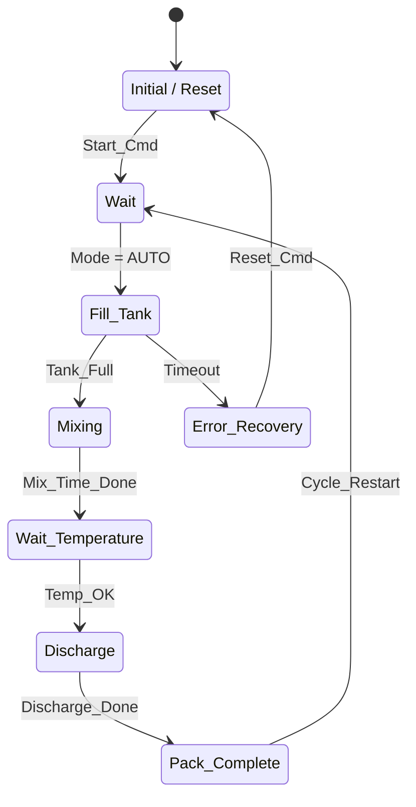

# GREENFIELD_FLOWCHART.md — Flowchart Design Guide

> **Goal:** design the sequence / state machine of a greenfield project correctly from the start, using IEC 61131-3 SFC + ISA-88 discipline.

---

## 1. Prerequisites

- [ ] Workshop with the customer (production flow concrete)
- [ ] RD04 Mode draft (for mode-aware steps)
- [ ] RD10 FBSpec (is FB_Sequence going to be used?)
- [ ] Agreement reached on the mechanical design

---

## 2. Design Philosophy

The greenfield advantage: SFC or `CASE OF` state machine is written clean from day one.

**Two approaches:**

### 2.1 Siemens GRAPH 7 / TIA SFC
- Use the SFC editor directly
- Code can be auto-generated from the RD03 table (Gate 5 prompt)
- Visual + readable

### 2.2 SCL `CASE OF` State Machine
- IEC 61131-3 standard
- Platform-independent, portable
- More flexibility

**Decision:**
- Customer is Siemens-centric → GRAPH 7
- Multi-platform or CODESYS/AB → SCL `CASE OF`

---

## 3. Design Steps

### 3.1 Step 1 — High-Level Sequence

Output of the customer workshop:

```
1. Cycle Start
2. Fill Tank (3 minutes)
3. Mix (5 minutes)
4. Wait for Temperature
5. Discharge to Pack
6. Pack Complete
7. Loop (back to 1)
```

This high-level flow maps into RD03 as steps.

### 3.2 Step 2 — Step Numbering (spaced by 10s)

```
S000 = Initial / Reset (fixed)
S010 = Cycle_Start_Wait
S020 = Fill_Tank
S030 = Mixing
S040 = Wait_Temperature
S050 = Discharge_Pack
S060 = Pack_Complete
S099 = Error_Recovery (always separate)
```

Spacing by 10 → makes it possible to insert steps later (S025 slips in).

### 3.3 Step 3 — Mode-Aware Design

Which mode is active in each step:

```yaml
S010 Cycle_Start_Wait:
  ModeReq: M01 (Auto), M03 (Setup)
  
S020 Fill_Tank:
  ModeReq: M01 (Auto)
  # No fill_tank in Manual; the operator opens the valve manually

S099 Error_Recovery:
  ModeReq: ALL (accessible in every mode)
```

### 3.4 Step 4 — Action Design

The action of each step is concrete tag manipulation:

```yaml
S020 Fill_Tank actions:
  - OPEN_VALVE_FILL := TRUE       (V01_OUT)
  - START_PUMP_INLET := TRUE      (MOT_PUMP_01_OUT)
  - TMR_FILL_001.IN := TRUE       (start timer)
  - HMI_STATUS := "Filling Tank"
  
S020 ExitCondition:
  - LT_TK_001.rScaled >= 80.0
  OR
  - TMR_FILL_001.Q (timeout)
  
S020 NextStep:
  - S030 (normal)
  
S020 ErrorStep:
  - S099 (if TMR_FILL_001 timeout AND level insufficient)
```

### 3.5 Step 5 — Error Handling

An error path for every critical step:

```
S020 (Fill_Tank)
  └── Normal exit → S030
  └── Error: Timeout → S099 (Error_Recovery)
      └── ALM0050 triggered (Tank fill timeout)

S099 (Error_Recovery)
  └── On Reset_Cmd → S000 (Initial)
```

### 3.6 Step 6 — Mermaid Diagram

Visual verification during design:



---

## 4. ISA-88 Level Hierarchy

| Level | Example | In RD03 |
|-------|---------|---------|
| Phase | "fill_tank" | Single step |
| Operation | "batch_make" | Multiple steps (S020-S060) |
| Unit Procedure | "production_run" | The whole cycle |

The ISA88Level field on every step must be classified correctly.

---

## 5. Validation (Design Approval)

- [ ] All customer-workshop outputs reflected in steps
- [ ] Initial + Final + Error steps separated
- [ ] Mode-aware step behaviour designed
- [ ] Mermaid diagram rendered and approved by the operator
- [ ] Actions are concrete tag manipulation (not via the HMI)
- [ ] Timers defined in RD07
- [ ] Alarms linked to RD08

---

## 6. Common Design Pitfalls

- ❌ **No Initial + Final:** sequence never starts/never ends
- ❌ **No error path:** behaviour ambiguous when something fails
- ❌ **ModeReq empty:** Auto sequence runs in Manual mode (DANGEROUS)
- ❌ **Numbering out of order:** S001, S015, S007 → chronology broken
- ❌ **Generic step names:** "Step1, Step2..." → use "Fill_Tank, Mix_Batch..."
- ❌ **Broken Mermaid syntax:** the diagram won't render
- ❌ **Mixing Alternative/Parallel:** OR vs AND matter

---

## 7. Checklist

- [ ] Step inventory (numbered by 10s)
- [ ] StepType correct (Initial/Normal/Alternative/Parallel/Final)
- [ ] ModeReq on every step
- [ ] Action concrete (tag-based)
- [ ] Entry + Exit + Error conditions explicit
- [ ] Timer + Alarm cross-reference
- [ ] ISA-88 level chosen
- [ ] Mermaid diagram approved with the operator

---

## 8. Related Files

- **Spec:** `MDSCHEMA_RAWDATA_03_FLOWCHART.md`
- **Retrofit equivalent:** `RETROFIT_FLOWCHART.md`
- **Dependent RDs:** RD02 (Step counter), RD04 (Mode), RD07 (Timer), RD08 (Alarm)
- **Standards:** IEC 61131-3 §6.7 SFC, ISA-88 §4

---

*v1.1.0 — Full English body (2026-05-23). The sequence is the machine's "rhythm" — in greenfield a clean design = easy maintenance.*
