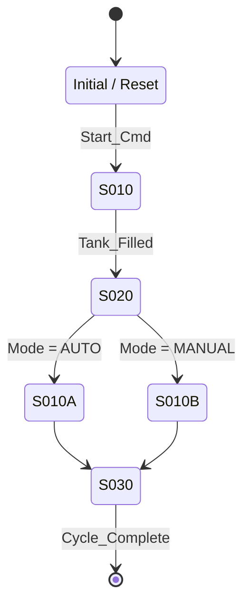

# PROMPT_EXTRACT_FLOWCHART_FROM_CODE.md — Flowchart Topic Extractor

> **Reads `_parsed.md` and extracts the sequential-control (SFC) flow into RD03 per the `MDSCHEMA_RAWDATA_03_FLOWCHART.md` spec.** Standardizes the sequence/state-machine structure of the legacy code.

---

## 1. When to Use?

- In Pipeline Gate 2, with `_parsed.md` ready and RD01/RD02 done
- Third of the 14 extractors
- **Retrofit** only

---

## 2. Position in Pipeline

```
[_parsed.md]
     ↓ (Sections 5/6: OB/PRG + 7: FB + 10: call tree)
[THIS PROMPT — Flowchart extractor]
     ↓
[RD03_Flowchart.xlsx + Mermaid stateDiagram]
     ↓ Gate 3 (human)
     ↓ Gate 5 (code gen → SCL state machine)
```

---

## 3. Target Spec

`MDSCHEMA_RAWDATA_03_FLOWCHART.md`.

| Spec | Application |
|---|---|
| StepID `^S\d{3}[A-Z]?$` | S001, S002, ... per step |
| StepType enum (Initial/Normal/Alternative/Parallel/Final) | Derive from sequence structure |
| EntryCondition + ExitCondition | Split out the Boolean conditions |
| Actions | I/O assignments executed in the step |
| NextStep + ErrorStep | Transition logic |
| ISA88Level | Which level (Phase/Operation/Procedure) |

---

## 4. System Prompt

```
You are an engineer with expertise in IEC 61131-3 SFC (Sequential Function
Chart), ISA-88 batch standard and PLC sequence programming. Your job:
extract the sequence/state-machine structure of the legacy code from
_parsed.md and produce an Excel + Mermaid output that conforms to the
MDSCHEMA_RAWDATA_03_FLOWCHART.md spec.

SOURCE HINTS (how sequences may appear in the legacy code):
  - Siemens GRAPH 7 FBs → native SFC, easiest to extract
  - Manual step pattern: M10.0..M10.7 set/reset bits in sequence
  - Step DB: an "ActiveStep" word/int in a DB, controlled by CASE/IF
  - State machine inside an FB: ENUM or CASE OF
  - Allen-Bradley: SFC routine, or programmer-written manual sequence in LD
  - CODESYS: native SFC, or CASE OF state

STRICT RULES:
1. Do not contradict the spec — 14 columns:
   StepID, StepName, StepType, Description, EntryCondition, ExitCondition,
   Actions, NextStep, ErrorStep, TimerRef, ModeReq, ISA88Level, Notes, Status
2. StepID format `^S\d{3}[A-Z]?$`:
   - S000 = Initial (usually unique). Sequence: S010, S020, S030 (spacing by 10 —
     so additional steps can be inserted later)
   - Parallel branches: S010A, S010B
   - Sub-state machines: main S001..S100, use a separate range for sub
3. StepType determination:
   - Initial: single step at program entry (typically after RESET completes)
   - Normal: standard step
   - Alternative: OR-divergence (one of several branches taken)
   - Parallel: AND-divergence (concurrent branches start)
   - Final: sequence end (typically sets a Done flag)
4. EntryCondition: condition to enter the step (TRUE = no entry condition)
   - For Initial step EntryCondition = TRUE (fixed rule)
5. ExitCondition: condition to leave the step (to advance to the next step)
6. Actions: actions executed while the step is active
   - Format: lines of "RD01 Tag := value"
   - Example: "MOT_PUMP_01_OUT := TRUE; TMR_HOLD_001.IN := TRUE"
7. NextStep: StepID of the next step
   - Alternative: "S010A | S010B" (OR-list)
   - Parallel: "S020A & S020B" (AND-list)
   - Final: write "(end)"
8. ErrorStep: step to branch to on error (blank if none)
9. TimerRef: timer associated with this step (from RD07, format `TMR_XX_001`)
10. ModeReq: which mode this step is active in (RD04 ModeID, comma-separated)
11. ISA88Level:
    - Phase: smallest unit (e.g. "fill_tank")
    - Operation: composed of Phases (e.g. "batch_make")
    - Procedure: composed of Operations, higher level
    - UnitProc: ISA-88 Unit Procedure (top)
12. Uncertainty:
   - If the code is clearly not a sequence → push to #UNKNOWNS
   - DO NOT write "?", "TODO"

EXTRA OUTPUT — MERMAID STATE DIAGRAM:
After the table, produce a Mermaid stateDiagram-v2 code block:



OUTPUT FORMAT:

```markdown
# RD03_Flowchart_draft.md
> Auto-generated from _parsed.md; awaiting Gate 3 human review

## Summary
- Total steps: <N>
- StepType distribution: Initial <1>, Normal <n>, Alternative <n>, Parallel <n>, Final <n>
- ISA-88 levels: Phase <n>, Operation <n>, Procedure <n>, UnitProc <n>
- Mode-dependent steps: <n>

## Flow Steps

| StepID | StepName | StepType | Description | EntryCondition | ExitCondition | Actions | NextStep | ErrorStep | TimerRef | ModeReq | ISA88Level | Notes | Status |
|--------|----------|----------|-------------|----------------|---------------|---------|----------|-----------|----------|---------|------------|-------|--------|
| S000 | Initial | Initial | Initial state / reset | TRUE | Start_Cmd | All outputs := FALSE | S010 | - | - | AUTO,MAN | Phase | | Active |
| ... | ... | ... | ... | ... | ... | ... | ... | ... | ... | ... | ... | ... | ... |

## Mermaid Diagram

\```mermaid
stateDiagram-v2
    [*] --> S000
    ...
\```

## #UNKNOWNS (human fills in at Gate 3)

| Legacy block | Reason |
|--------------|--------|
| FB_OldSequencer | Ambiguous state machine — CASE/IF structure could not be parsed |
```

IMPORTANT:
- Mermaid syntax must be valid
- Table in Markdown format
- At least one row per step (NO blank rows)
```

---

## 5. User Prompt Template

```
TASK: Extract RD03 Flowchart from _parsed.md.

PROJECT: <project_name>
INPUT: _input/_parsed.md
SCOPE:
  - GRAPH 7 / SFC FB present: <Y/N> (preferred source when present)
  - State machine FB: <FB names>
  - Sequence DB: <DB names>

SPECIAL:
  - Initial step must have EntryCondition = TRUE
  - Number by 10 (S010, S020, S030...) so steps can be inserted later
  - Mermaid diagram must be consistent with the table

OUTPUT:
  - RD03_Flowchart_draft.md (table + Mermaid)
  - Ambiguities in #UNKNOWNS
```

---

## 6. Output Validation

- [ ] 14 columns, correct order
- [ ] StepID matches the regex (`^S\d{3}[A-Z]?$`)
- [ ] Initial step has EntryCondition=TRUE
- [ ] StepType in the valid enum
- [ ] NextStep references valid (point to StepIDs that exist in the table)
- [ ] Mermaid stateDiagram-v2 code block present and syntactically valid
- [ ] ISA88Level in the valid enum
- [ ] Final step has NextStep="(end)"
- [ ] #UNKNOWNS section present

---

## 7. Typical AI Errors

### 7.1 Syntax (Category A)
- StepID lowercase `s010` → regex reject
- Mermaid syntax broken (missing state, wrong arrow) → render fail

### 7.2 Schema/Standard (Category B)
- Initial step EntryCondition not TRUE → conditional reject
- ErrorStep references a StepID missing from the table → integrity reject
- ISA88Level left blank → reject

### 7.3 Semantic (Category C) — manual review
- ⚠️ Manual step pattern (M-bit set/reset) not recognized as a sequence, skipped — even though the operator describes it
- ⚠️ GRAPH 7 FB available but ignored; less reliable source used instead
- ⚠️ Alternative and Parallel confused — OR-divergence vs AND-divergence is critical
- ⚠️ Mermaid for Alternative has a single transition (should be two); Parallel branches not shown separately
- ⚠️ Actions written only for some steps, others left empty (suspicious gaps)
- ⚠️ ModeReq left blank — RD04 reference is critical; mode-specific step behavior lost
- ⚠️ Step numbering out of order (S001, S015, S007) — chronology broken
- ⚠️ Non-state-machine code mistakenly treated as a sequence (false positive) — skip if the legacy logic is plain LD

### 7.4 Correction

> "RD03 draft <StepID>: <category> issue: <description>. Expected: <correct>."

---

## 8. Spec Coupling

| Spec | This prompt |
|---|---|
| StepID regex | Rule 2 |
| Initial → EntryCondition=TRUE | Rule 4 |
| Mermaid output | Extra-output section |
| ISA-88 Level | Rule 11 |

---

## 9. Related Files

- **Spec:** `01_GLOBAL_STANDARDS/md_schemas/MDSCHEMA_RAWDATA_03_FLOWCHART.md`
- **Previous extractor:** `PROMPT_EXTRACT_DATADICT_FROM_CODE.md`
- **Next extractor:** `PROMPT_EXTRACT_MODE_FROM_CODE.md`
- **Dependent RDs:** RD04 (ModeReq), RD07 (TimerRef), RD01 (Actions tags)
- **Human guide:** `02_PROJECT_TYPES/RETROFIT/RETROFIT_EXTRACT_FLOWCHART.md` (Phase 4)

---

## 10. Feedback

```bash
python 05_SCRIPTS/script_propose_update.py \
  --target "04_AI_PROMPTS/analyze/PROMPT_EXTRACT_FLOWCHART_FROM_CODE.md"
```

---

*v1.1.0 — Full English body (2026-05-23). Sequence extraction is among the hardest extractors due to wide source diversity (GRAPH 7 / manual M-bit / CASE OF). v1.2.0 roadmap: TwinCAT NCI sequence, deeper AB SFC routine support.*
