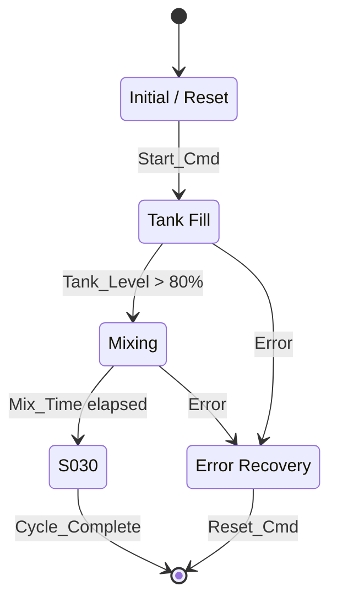

# RD03_Flowchart — Per-Project Template

> Spec: `MDSCHEMA_RAWDATA_03_FLOWCHART.md`. Schema: `rd03_flowchart.schema.json`.

---

## Frontmatter

```yaml
project_id: <PROJECT_CODE>
filled_by: <Engineer Name>
filled_at: <YYYY-MM-DD>
status: <DRAFT | REVIEWED | APPROVED>
```

---

## Summary

- Total steps: __
- StepType: Initial __ | Normal __ | Alternative __ | Parallel __ | Final __
- ISA-88 levels: Phase __ | Operation __ | Procedure __ | UnitProc __
- Mode-dependent steps: __

---

## Flow Steps

| StepID | StepName | StepType | Description | EntryCondition | ExitCondition | Actions | NextStep | ErrorStep | TimerRef | ModeReq | ISA88Level | Notes | Status |
|--------|----------|----------|-------------|----------------|---------------|---------|----------|-----------|----------|---------|------------|-------|--------|
| S000 | Initial | Initial | Initial state / reset | TRUE | Start_Cmd | All outputs := FALSE | S010 | | | AUTO,MAN | Phase | | Active |
| S010 | Tank_Fill | Normal | Tank filling | S000 done | Tank_Level > 80% | Open V_Fill, Start Pump | S020 | S099 | TMR_HOLD_001 | AUTO | Phase | | Active |
| S020 | Mixing | Normal | Mixing | S010 done | Mix_Time elapsed | Start Mixer | S030 | S099 | TMR_MIX_001 | AUTO | Phase | | Active |
| S099 | Error_Recovery | Final | Error state | Error active | Reset_Cmd | Stop all, alarm | (end) | | | ALL | Phase | | Active |

---

## Mermaid Diagram



---

## #UNKNOWNS

| Old Block | Reason |
|-----------|--------|
| | |

---

## Fill-in Notes

- **StepID format:** `^S\d{3}[A-Z]?$` — leave gaps of 10 (S010, S020, S030...)
- **Initial step EntryCondition = TRUE** (mandatory)
- **Alternative:** OR-divergence (`S010A | S010B`)
- **Parallel:** AND-divergence (`S020A & S020B`)
- **Final:** NextStep = `(end)`
- **Mermaid:** Must be consistent with the table

---

*Template v1.0.0 — RD03 Flowchart.*
