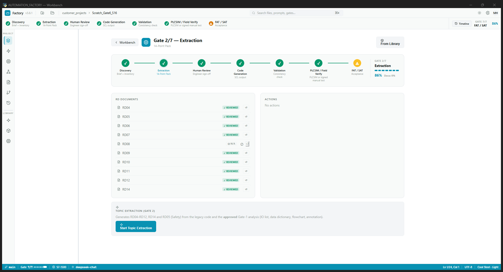
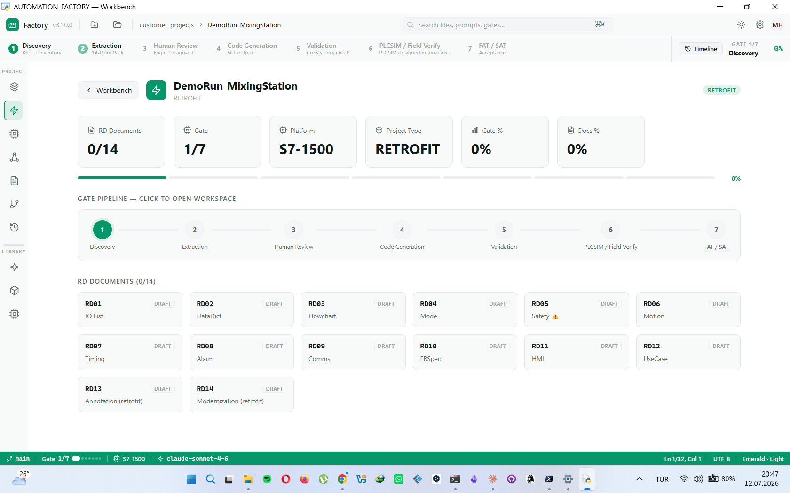
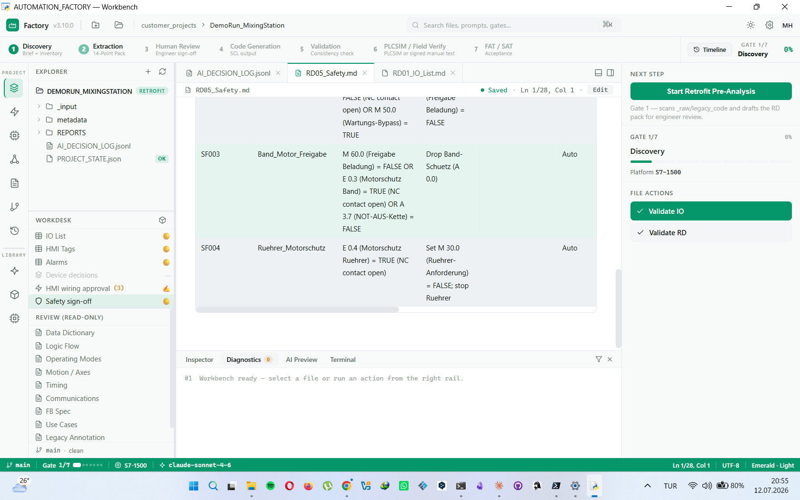
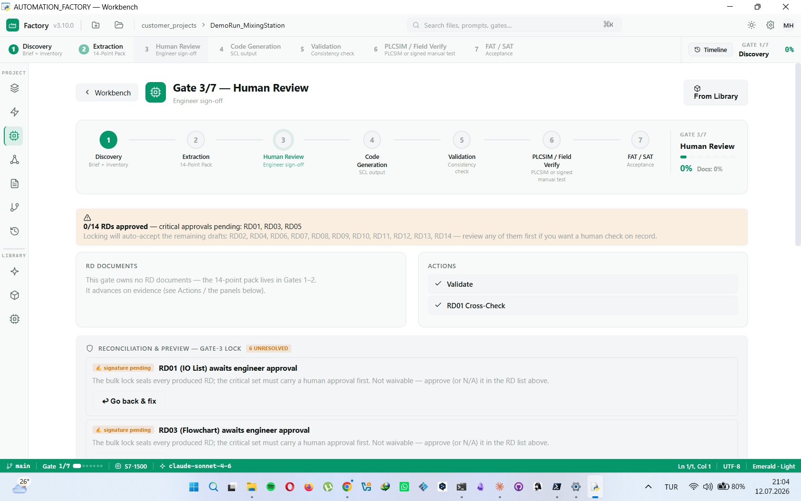
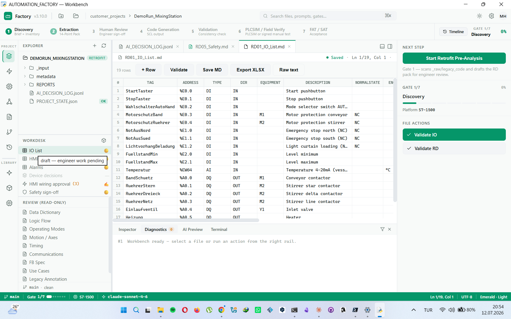
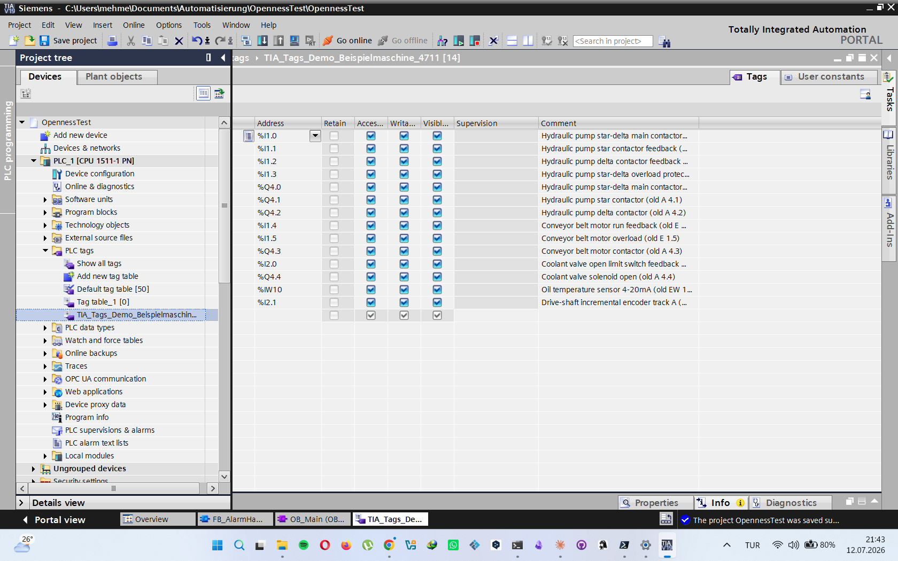

# 🏭 AUTOMATION_FACTORY

[](https://github.com/Mehmet-Haydar/automation-factory/actions/workflows/tests.yml)
[](https://github.com/Mehmet-Haydar/automation-factory/actions/workflows/ci.yml)
[](LICENSE)


**English** · [Türkçe](README_TR.md) · [Deutsch](README_DE.md)

> **AI-assisted industrial PLC programming framework.** Legacy PLC code (S5/S7/AB/CODESYS) or greenfield brief → standardized 14-Point Raw Data Pack → AI-generated industrial-standard SCL code.


*The 7-gate pipeline: AI drafts the 14-point requirements pack, the engineer reviews & signs where it matters, then library-first SCL is generated for S7-1500.*

**Version:** v3.10.0 (HMI & reconciliation V2: approved wiring codegen · Gate-3 reconciliation+waivers · direct .s5d import)
**Docs:** [Installation](INSTALLATION.md) · [Showcase](docs/SHOWCASE.md) · [Retrofit Guide](docs/USER_GUIDE_RETROFIT.md) · [Architecture](docs/ARCHITECTURE.md) · [Changelog](CHANGELOG.md) · [Security](SECURITY.md) · [Contributing](CONTRIBUTING.md)
**Platform:** Siemens TIA (S7-1200/1500, SCL) — primary, field-targeted. Allen-Bradley / Beckhoff / CODESYS: analysis prompts + platform matrix only (no curated code library yet).
**Language:** System EN. AI outputs (RD drafts, sequence-FB comments) follow the per-project output language (TR/EN/DE — set in the project target card); curated library blocks keep English comments.

---

## 👋 Honest note — what this is (and isn't)

I'm an **automation engineer**, not a software developer. I built this while
learning, by **directing AI tools** — proposing ideas, testing, failing,
iterating. The Python was written by AI under my direction; what I brought is
the **domain judgment**: how a good engineer should approach a legacy
retrofit, why a *wrong* interlock is worse than a *missing* one, why SIL can
never be guessed, why a maintenance electrician reads ladder, not SCL.

So this is **not** a finished product and I make **no** claim that it is. It
has been proven end-to-end on **one** real, undocumented S5 machine (a legacy
grinding line, ~300 IO) — it produced a TIA project that
compiled with zero errors and a full 14-document pack. That is a *validated
core*, not a *shipped tool*: it needs more real machines, a live PLCSIM run,
and a pilot before anyone should trust it in production.

What I think is genuinely worth a look is the **architecture, not the AI
output** — a deterministic verification layer that **proves** its own
extraction (replays legacy bit-logic on 128 random vectors) and **says
"I don't know"** instead of hallucinating. That discipline — honesty over
confident garbage — is the point, and it comes from the field, not the model.

If any of it is useful to you, take it. Feedback and corrections welcome.

**Background:** Built over ~2 months (May–July 2026) as a solo, AI-assisted effort — 15 releases (v3.0 → v3.10), 1600+ automated tests, from first concept to a validated core proven end-to-end on a real machine. The [Changelog](CHANGELOG.md) is the full journey.

---

## 🎬 Demo — see it work

The [`examples/DemoRun_MixingStation/`](examples/DemoRun_MixingStation/) project was produced **live, end-to-end**: synthetic S7-300 legacy code → 14-Point Requirements Pack → library-first SCL → **imported and compiled in a real TIA Portal V19**.

| 14-Point Pack (project dashboard) | Safety analysis — certified-engineer sign-off (RD05) |
|:---:|:---:|
|  |  |
| **Human-in-the-loop gate lock (Gate 3)** | **Editable IO list (RD01)** |
|  |  |
| **Generated SCL, compiled in TIA Portal V19** | **IO tags imported into TIA** |
|  |  |

*The AI drafts every requirement doc as `DRAFT_UNVERIFIED`; SIL/PLr is never guessed; the gate lock cannot advance until the critical docs carry a named engineer approval. See the [demo project README](examples/DemoRun_MixingStation/README.md).*

---

## 🎯 Is this tool right for you?

Honest scope, before you invest an afternoon:

**A good fit when…**
- Your **target** is Siemens **S7-1200/1500 (TIA Portal)** — generated SCL uses `REGION` syntax and optimized block access.
- You can provide legacy code as **text sources**: AWL/STL/SCL exports, symbol tables, PDF listings. `.s7p`/`.zap` project archives are **not read directly** — export sources from SIMATIC Manager / TIA first (the GUI shows the exact steps).
- Your IT policy allows **cloud AI APIs** (Anthropic / Google / OpenAI / DeepSeek). The built-in data-classification guard controls *what* may leave, but there is no offline model mode yet.
- You want a **documented, auditable** flow (14-point Raw Data Pack, gate sign-offs, EU AI Act decision log) — not a one-shot code generator.

**Not (yet) a fit when…**
- The target hardware stays **S7-300/400 classic** — the generated blocks will not compile for classic CPUs.
- You work fully **offline / air-gapped** — local-model support is on the roadmap, not shipped.
- You expect one-click TIA import everywhere: the Openness direct path needs TIA Portal V19–V21 + `pythonnet` + the *Siemens TIA Openness* Windows group. Without them the GUI offers manual SCL import steps instead.
- Gate 6 simulation requires **PLCSIM Advanced** (separate Siemens license); without it you sign a manual-test declaration.
- You need code in 10 minutes: the gated flow (analysis → engineer review → sign-off → code gen) takes roughly **half a working day** for a real retrofit — that is the price of an auditable result.

---

## ⚡ Quick Start

> 🎯 **Using this as a template?** Click **"Use this template"** at the top of the GitHub page to create your own copy, then follow the steps below in your new repo.

### 1. Installation

For all required tools + Python + AI services: **[INSTALLATION.md](INSTALLATION.md)**

> **Fastest path (Windows):** install Python 3.10+ → unzip this repo →
> double-click **`install.bat`** once (creates the environment) → from then
> on just **`start.bat`** (launches instantly, installs nothing).

Summary (paths like `D:\automation_workspace` are **examples** — use your own workspace root):
```bash
# 1. Install Git, Python 3.10+, VS Code/Cursor (details in INSTALLATION.md)

# 2. Create workspace
mkdir D:\automation_workspace
cd D:\automation_workspace

# 3. Clone the factory
git clone https://github.com/Mehmet-Haydar/automation-factory.git

# 4. Install Python dependencies
cd automation-factory
python -m venv .venv
.\.venv\Scripts\Activate.ps1     # Windows
pip install -r requirements.txt

# 5. Test it
python 05_SCRIPTS/script_project_init.py --help
```

#### Supported AI providers

You are **not** locked to one vendor. Add any of these keys in
**Settings → provider cards** (stored in the OS keystore) and route tasks
per provider:

| Provider | Best at (default routing) | Get a key | Cost note |
|----------|---------------------------|-----------|-----------|
| **Anthropic Claude** | SCL generation, code analysis, safety review | [console.anthropic.com](https://console.anthropic.com) | paid API |
| **Google Gemini** | PDF/P&ID pre-analysis, photos, translation | [aistudio.google.com/apikey](https://aistudio.google.com/apikey) | **free tier is sufficient** for most retrofit pre-analyses |
| **DeepSeek** | low-cost template code (PUBLIC projects only) | [platform.deepseek.com](https://platform.deepseek.com) | very low cost |
| **OpenAI** | general alternative | [platform.openai.com](https://platform.openai.com) | paid API |

One key is enough to start — **Gemini's free tier** lets you try the whole
retrofit pre-analysis pipeline at zero cost. Task→provider routing is
configurable in Settings (e.g. Gemini reads the PDFs, Claude writes the SCL).

### 2. Create Your First Customer Project

```bash
# Create the customer folder OUTSIDE the factory
mkdir D:\automation_workspace\customer_projects

# Initialize a new project
python 05_SCRIPTS/script_project_init.py \
  --name "TestProject_2026" \
  --type retrofit \
  --customer "Test Customer GmbH" \
  --output "D:\automation_workspace\customer_projects" \
  --output-lang DE
```

Result: `D:\automation_workspace\customer_projects\TestProject_2026\` is created — **the factory is untouched**.

---

## 📐 Folder Structure (Recommended)

```
D:\automation_workspace\                    ← Workspace root
│
├── AUTOMATION_FACTORY\                     ← This repo (public on GitHub)
│   ├── 01_GLOBAL_STANDARDS\               ← Rules (NAMING, DATA_CLASS, LANG, ...)
│   ├── 02_PROJECT_TYPES\                 ← Retrofit + Greenfield guides
│   ├── 03_DOMAIN_TOOLS\                  ← HMI/Safety/Drives domain standards
│   ├── 04_AI_PROMPTS\                      ← AI prompt library (analyze/code_gen/review/test_gen)
│   ├── 05_SCRIPTS\                         ← Python tools + GUI
│   ├── 06_KNOWLEDGE_BASE\                  ← Pitfalls + lessons learned
│   ├── 07_PROJECT_TEMPLATE\                ← New project scaffold template
│   ├── 08_METADATA_INPUT\                  ← JSON validation schemas
│   ├── 09_HARDWARE_LIBRARY\               ← Drive + IO module technical cards
│   ├── docs\                               ← Developer notes (workflow, backlog, log)
│   └── examples\                           ← SYNTHETIC demo project (training purposes)
│       └── Kunde_Mueller_Conveyor_Retrofit\   ← Fictional German customer
│
└── customer_projects\                      ← REAL customer projects (OUTSIDE the factory!)
    ├── CustomerA_Conveyor_2026\               ← Never goes to GitHub
    ├── Arcelik_Press_2026\                ← Each customer in their own folder
    └── ...
```

**Key distinction:**
- `examples/` = synthetic demo (publicly visible) — part of the factory
- `customer_projects/` = real customer data (🟠 CONFIDENTIAL) — **separate from the factory**

---

## 🎯 14-Point Raw Data Pack

The 14 standard documents filled in for every project:

| RD | Name | Contents |
|----|------|----------|
| 01 | IO List | Physical input/output signals |
| 02 | Data Dictionary | Internal variables (DB/UDT/markers) |
| 03 | Flowchart | Sequence/SFC + Mermaid diagram |
| 04 | Modes | OMAC PackML compliant |
| 05 | **Safety** ⚠️ | F-FB + SIL/PLr (certified engineer approval required) |
| 06 | Motion | PLCopen Motion v2.0 |
| 07 | Timing | Timers/watchdogs |
| 08 | Alarms | ISA-18.2 multi-language |
| 09 | Communications | PROFINET/EtherCAT/Modbus/OPC UA |
| 10 | FB Spec | Reusable function blocks |
| 11 | HMI | ISA-101 screens + tags |
| 12 | Use Cases | FAT/SAT source |
| 13 | Legacy Annotation | Line-by-line meaning of legacy code (retrofit) |
| 14 | Modernization | Anti-pattern + decision matrix (retrofit) |

---

## 🔄 7-Gate Pipeline

```
Gate 1 DISCOVERY          (customer brief + machine inventory)
  └─ Retrofit Pre-Analysis (optional): Gemini reads _raw/ drawings, photos,
     EPLAN PDFs, legacy code → produces draft RD01/RD02 for Gate 3 review
Gate 2 EXTRACTION         (AI-assisted generation of 14 RDs)
Gate 3 HUMAN REVIEW       (engineer review, filling #UNKNOWNS)
Gate 4 VALIDATION         (script_consistency_check.py)
Gate 5 CODE GENERATION    (AI-generated SCL code)
Gate 6 SIMULATION         (offline test environment)
Gate 7 FAT/SAT            (factory + site acceptance testing)
```

### Retrofit Pre-Analysis (`_raw/` folder)

For retrofit projects, drop legacy documents into the `_raw/` folder before starting Gate 1:

```
project/
  _raw/
    drawings/     ← EPLAN PDFs, P&IDs, electrical schematics
    photos/       ← panel photos, nameplate images
    docs/         ← manuals, technical specifications
    legacy_code/  ← old SCL/AWL/STL/text files — or PDF prints
                    (e.g. "S5/S7 for Windows" exports)
```

Legacy-code **PDFs** are extracted to text first (pdfplumber; scanned
PDFs fall back to consent-gated Gemini Vision OCR) and must be
**reviewed + confirmed** by the engineer before analysis — OCR confusions
like O↔0 silently corrupt addresses.

**Which old project files work directly?** (typical STEP5 archive:
`4711st.s5d`, `4711Z0.SEQ`, `*.INI`)

| File | What it is | Directly usable? |
|------|-----------|------------------|
| `.SEQ` | STEP5 symbol table (Zuordnungsliste) — tag + description | ✅ Yes — drop it in; it IS the raw IO list |
| `.awl` / `.stl` / `.txt` / `.src` | AWL/STL text listing | ✅ Yes |
| PDF print of the listing | text or scan | ✅ Yes (extraction + review step) |
| `.s5d` / `.s7p` | **Binary** STEP5/STEP7 program (MC5 code) | ❌ No — the tool detects it and tells you to export an AWL listing (text or PDF) via **S5/S7 for Windows** or STEP5 first |

So: the symbol table comes straight from the archive; for the program
*logic* you still need one export step from S5/S7 for Windows — that is
the healthy path, not a workaround.

The GUI shows a **"Start Retrofit Pre-Analysis"** button in Gate 1. After
the consent dialog, a 6-step background AI chain runs:
1. **Gemini Vision** reads drawings and photos → extracts IO signals
2. **Claude** analyses legacy code → identifies functional blocks
3–6. **Claude** consolidates both into RD drafts — **RD01** (IO list),
   **RD02** (data dictionary), **RD03** (step sequence + Mermaid),
   **RD13** (line annotation) — written directly into `metadata/` as
   `DRAFT_UNVERIFIED` (approved RDs are never overwritten; replaced
   drafts are backed up to `metadata/_history/`).

The engineer reviews and approves these drafts at **Gate 3 (Human Review)**.
After approval, **Assemble Program** builds the program *library-first*:
device FBs are copied **verbatim** from the curated library (SHA-256
proof in `REPORTS/ASSEMBLY_REPORT.md`), instance DBs + OB1 are generated
with field-signal bindings, and everything passes the validator + contract
gates. Unmatched devices land in an explicit **#UNKNOWN** list — never
silently dropped. The only AI-generated code artifact is the project
sequence FB (from the reviewed RD03).

Finally, **Send to TIA** (Openness, TIA V19/V20 + pythonnet) imports the
sources and runs a **compile preflight** — a clean compile upgrades the
label to `AUTO_VERIFIED_compile | PENDING_PLCSIM_VERIFY`. Without TIA on
the machine, **Export TIA** produces a copy-paste import folder instead.

**What exactly comes out?** TIA Portal **external source files**:
`.scl` (FBs, OB1) + `.db` (instance DBs) + an IEC tag table — i.e. the
same text sources TIA itself uses. **Not** a ready `.ap21` project file:
that container can only be produced by TIA Portal itself — which is
exactly what the Openness path uses TIA for (one click: import + compile
into *your* `.apXX` project). No Markdown in the code output; `.md` is
used only for the RD documentation pack.

**What stays human (by design, not as a gap):**
- **RD05 / functional safety** — the AI *never* writes safety logic or
  estimates SIL/PLr, even with engineer approval. It only *detects and
  reports* safety signals found in legacy code. F-programs are written by
  a (certified) engineer in TIA Safety.
- **PLCSIM behavioural run** — compile preflight proves the code
  *compiles*; it does not prove the *logic*. PLCSIM download is one click
  (real-PLC downloads are hard-blocked), but the test scenarios are still
  executed by the engineer at the watch table. An automated behaviour
  harness is the next roadmap item.
- **#UNKNOWN / TODO wiring** — the assembler binds only what it is
  *certain* about (feedbacks, overloads, main outputs). Everything
  uncertain is listed in `ASSEMBLY_REPORT.md` for the engineer — guessed
  IO addresses are a field hazard, so the tool refuses to guess.

Full click path: **[docs/USER_GUIDE_RETROFIT.md](docs/USER_GUIDE_RETROFIT.md)**

> **Data privacy (read carefully):** Legacy **code text** is anonymized — known customer fields (name, project ID, engineer) and PII regex patterns (email, phone, address) are replaced before the text is sent to a cloud AI. **Images, drawings and PDFs are NOT automatically anonymized:** they are uploaded as-is and only *deleted* from Google servers immediately after each call. You must manually redact logos, title blocks and names from drawings/photos before running pre-analysis. The PII regexes are tuned for German-format contact data — verify coverage for other locales. CONFIDENTIAL projects require explicit engineer consent (a soft-block, logged); RESTRICTED data is never sent.

Details: [PIPELINE_CODE_REWRITE.md](docs/PIPELINE_CODE_REWRITE.md)

---

## 📚 Documentation

| File | Purpose |
|------|---------|
| **[INSTALLATION.md](INSTALLATION.md)** | Setup + required tools (Python/Git/IDE/AI) |
| **[docs/USER_GUIDE_RETROFIT.md](docs/USER_GUIDE_RETROFIT.md)** | Retrofit end-to-end click path (old code → TIA program) |
| **[docs/USER_GUIDE_BIG_PICTURE.md](docs/USER_GUIDE_BIG_PICTURE.md)** | Comprehensive usage guide |
| **[docs/PROJECT_VISION.md](docs/PROJECT_VISION.md)** | Vision + philosophy |
| **[CHANGELOG.md](CHANGELOG.md)** | Release history |
| `examples/Kunde_Mueller_Conveyor_Retrofit/README.md` | Synthetic example project |

---

## 🎓 Example Project

To see the factory in action with a concrete example:

📂 **[`examples/Kunde_Mueller_Conveyor_Retrofit/`](examples/Kunde_Mueller_Conveyor_Retrofit/)**

Contains:
- Synthetic German customer (Kunde Müller GmbH) 1995 S7-300 retrofit scenario
- All 14 RDs filled in (including RD05 Safety critical finding example)
- Legacy AWL code example → modern SCL code output (with German comments)
- Modernization decision matrix for customer presentation (€60K)

---

## 🛡️ Data Classification + Security

| Class | Color | Example | AI Policy |
|-------|-------|---------|-----------|
| PUBLIC | 🟢 | This factory, pattern examples | Any AI |
| INTERNAL | 🟡 | Company-internal standards | Cursor/Claude Team+ |
| **CONFIDENTIAL** | 🟠 | **Customer code** | **Self-hosted / Enterprise AI REQUIRED** |
| RESTRICTED | 🔴 | ITAR/EAR, defense | Air-gapped |

Details: `01_GLOBAL_STANDARDS/rules/GLOBAL_DATA_CLASSIFICATION.md`

**⚠️ Customer code MUST NOT be sent to public AI APIs.** The built-in `data_classification_guard` enforces this at every AI call. CONFIDENTIAL projects require the AI provider to be self-hosted or enterprise-tier (Anthropic Enterprise, Azure OpenAI with data residency).

---

## ⚖️ AI Responsibility Disclaimer

> **AUTOMATION_FACTORY generates code and documents to assist a qualified engineer.  
> It does NOT replace engineering judgment, certification, or human sign-off.**
>
> Full industrial-use disclaimer (no warranty, verification obligation,
> liability): **[DISCLAIMER.md](DISCLAIMER.md)**

| Topic | Statement |
|-------|-----------|
| **Output status** | Verification tiers: `AUTO_VERIFIED_structural` (keyword/structure checks only) → `AUTO_VERIFIED_compile` (compiled clean in TIA via the Openness preflight) → PLCSIM behavioural test (Gate 6, still human-driven). Everything below the last tier is **DRAFT** — not field-ready. |
| **Safety** | AI output is **never** authoritative for Safety-Instrumented Systems (SIS). SIL/PLr assignment, F-block selection, and safety validation require a certified safety engineer (TÜV, FS Engineer). |
| **Liability** | The engineer who imports, modifies, or approves AI-generated code bears full professional and legal responsibility for the resulting PLC program. The authors of this software accept no liability for production incidents, equipment damage, or personal injury arising from the use of AI-generated outputs. |
| **Data privacy** | The built-in `data_classification_guard` blocks CONFIDENTIAL/RESTRICTED project data from reaching public AI APIs. The user remains responsible for verifying data classification before opening a project. |
| **API keys** | API keys are stored in the OS keystore (Windows Credential Vault / macOS Keychain). They are never sent to any server operated by this software. |

---

## 🤖 AI Discipline

Core rules of the factory:

1. **AI accelerates, the engineer decides, the customer signs**
2. **AI NEVER estimates SIL/PLr levels** — RD05 Safety = DRAFT_UNVERIFIED, certified engineer approval is mandatory
3. **Customer data discipline** — classification guard enforced at API call time; CONFIDENTIAL data blocked from public-tier providers
4. **#UNKNOWNS are never skipped** — fields awaiting human review in AI output are mandatory
5. **Direct API only** — no clipboard-relay, no IDE proxy; all AI calls go through `AIClient` with a keystore-backed API key

---

## 🛠️ Development

Propose a new feature:
```bash
python 05_SCRIPTS/script_propose_update.py \
  --target "01_GLOBAL_STANDARDS/rules/GLOBAL_NAMING_STANDARD.md" \
  --reason "..." \
  --suggestion "..."
```

Factory audit:
```bash
python 05_SCRIPTS/dev/script_factory_audit.py
python 05_SCRIPTS/script_state_validator.py
```

---

## 📊 Version Roadmap

| Version | Status | Contents |
|---------|--------|----------|
| v3.0.0-alpha | ✅ COMPLETE | System docs, 14-Point Pack, AI prompts, guides |
| v3.1.0-alpha | ✅ SHIPPED | Workbench IDE Phases A–J, TIA Send dialog, Library seed, `start.bat` consolidation |
| v3.2.0 | ✅ SHIPPED | Fixed-FB Library + Acceptance Gate (18 blocks) + CI + direct API + keyring + PII guard |
| **v3.3.0** | ✅ SHIPPED | Multi-AI Team — per-provider settings, task routing, Retrofit Pre-Analysis pipeline (Gemini Vision + Claude), CONFIDENTIAL soft-block guard |
| **v3.4.0** | ✅ SHIPPED | PDF/text legacy input + OCR review, 6-step pre-analysis → RD drafts, library-first **Assemble Program**, **TIA compile preflight** (`AUTO_VERIFIED_compile`) · **Flowchart View** — RD03 diagram derived from the step table (offline mermaid), change-request chat with deterministic impact check, gate staleness warning, English status enums |
| **v3.5.0** | ✅ SHIPPED | v3.4.x field fixes (live-verified tag-table import, Send-to-TIA live step view + engineer-approved fix assist) · **UX overhaul** — PROJECT/LIBRARY workspaces, guided onboarding, one source of truth for gate status, honest buttons, native file pickers |
| **v3.6.0** | ✅ SHIPPED | **Version Compare** — deterministic diff between legacy archive versions (`_Versionen/` ↔ `_aktiv/`): S5 symbol-table diff, text diff, honest binary notes · AI change hypotheses (`DRAFT_UNVERIFIED`, full C4/S-20/audit safety chain) |
| **v3.7.0** | ✅ SHIPPED | **SAT v2** (IEC 62381-aligned, real SAT ≠ FAT) · **i18n DE/EN/TR** protocol engine · **IEC 62443 / NIS2** cybersecurity section · **IEC 62682** alarm rationalization columns · **SISTEMA** helper (prep list + engineer-declaration CRUD) · **CE wesentliche Veränderung** assessment (DE/EN/TR) · PDF output via `pdf_common.py` · passive nightly TIA compile CI (Kademe 2) |
| **v3.7.1** | ✅ SHIPPED | Pre-final audit fixes: reveal-folder broken after protocol generation · project-path leak in GUI log · CE PDF `<br>` escape · SISTEMA prep language selector (was always German) |
| **v3.8.0** | ✅ SHIPPED | **RAG-KB pipeline** (offline-first BM25 + optional semantic): KB Entry Contract, `rag/ingest.py` + `rag/retrieve.py`, datasheet ingest (PDF→device→library), safety warning chain (red banner + confirm), OB1 vendor context injection · **PLC validation orchestrator** (L1 structural + L2 logic, hash-cache, auto-fix loop, müfettiş audit) · 1378 tests |
| **v3.8.1** | ✅ SHIPPED | Security hardening (AUDIT-001..005: path-traversal, consent chain, audit-log, IP-leakage, PII) · `PROJECT_STATE.json` thread-safe writes (`threading.Lock`) — eliminates race condition under concurrent async calls · 1383 tests |
| **v3.9.0** | ✅ SHIPPED | Public-release readiness — field-fitness audit fixes + **two-gear flow** (one-click full analysis, risk-based 14→3 approval, delta assembly / change management) · 1584+ tests |
| **v3.10.0** | ✅ SHIPPED | **HMI & reconciliation V2** — role-based RD layout, RD11/RD08 grid editors, Gate-3 reconciliation+waivers, approved wiring codegen, direct .s5d import · independent multi-agent audit pass (privacy, dead-code, hygiene) |
| v4.0.0 | Planned | PLCSIM behavioural run (Kademe 3 / S-28), code_gen/motion/, code_gen/comm/, first real pilot, public release polish |

> **Validation status:** Generated/curated SCL starts at `AUTO_VERIFIED_structural | PENDING_TIA_VERIFY` (interface, regions, naming, patterns — no compile). With TIA V19/V20/V21 + pythonnet on the machine, **Send to TIA** runs a real Openness **compile preflight** and a clean compile upgrades the label to `AUTO_VERIFIED_compile | PENDING_PLCSIM_VERIFY`. PLCSIM **behavioural** verification and a real pilot project are still **pending** — treat AI-generated code as a reviewed draft until Gate 6 passes, never as field-ready.

---

## 🤝 Contributing

This factory is under active development. See **[CONTRIBUTING.md](CONTRIBUTING.md)**
for dev setup, test/CI requirements, and commit conventions, and the
**[Code of Conduct](CODE_OF_CONDUCT.md)**. If you are using it:
- Add pitfalls to the KB (`06_KNOWLEDGE_BASE/`)
- Add guides for new project types (`02_PROJECT_TYPES/`)
- Propose AI prompt improvements (`04_AI_PROMPTS/`)

> **Never commit real customer data or API keys.** All examples must be
> synthetic — see the data-classification rule in CONTRIBUTING.md.

GitHub Issues: https://github.com/Mehmet-Haydar/automation-factory/issues ·
Security: [SECURITY.md](SECURITY.md)

---

## 📄 License

See [LICENSE](LICENSE). When sharing in customer projects: `01_GLOBAL_STANDARDS/rules/GLOBAL_DATA_CLASSIFICATION.md`.

---

*v3.10.0 — 2026-07-10. AI-assisted factory for industrial automation engineering. Developed by Mehmet Haydar.*
