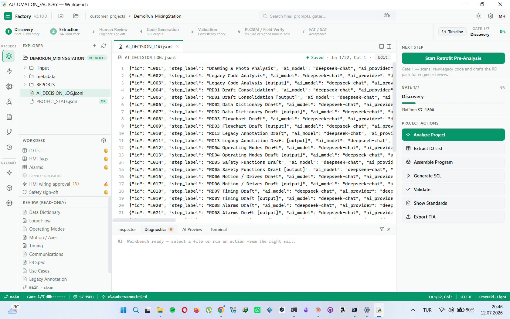

# 🏭 AUTOMATION_FACTORY

[](https://github.com/Mehmet-Haydar/automation-factory/actions/workflows/tests.yml)
[](https://github.com/Mehmet-Haydar/automation-factory/actions/workflows/ci.yml)
[](LICENSE)


[English](README.md) · [Türkçe](README_TR.md) · **Deutsch**

> **KI-gestütztes Framework für industrielle SPS-Programmierung.** Alt-SPS-Code (S5/S7/AB/CODESYS) oder Greenfield-Brief → standardisiertes 14-Punkte-Rohdatenpaket → KI-generierter SCL-Code nach Industriestandard.


*Die 7-Gate-Pipeline: Die KI entwirft das 14-Punkte-Anforderungspaket, der Ingenieur prüft und unterschreibt an den entscheidenden Stellen, dann wird bibliotheksbasierter SCL-Code für S7-1500 generiert.*

**Version:** v3.10.0 (HMI & Abgleich V2: freigegebene Verdrahtungs-Codegenerierung · Gate-3-Abgleich+Waiver · direkter .s5d-Import)
**Plattform:** Siemens TIA (S7-1200/1500, SCL) — primär, feldorientiert. Allen-Bradley / Beckhoff / CODESYS: nur Analyse-Prompts + Plattformmatrix (noch keine kuratierte Code-Bibliothek).
**Sprache:** System EN. KI-Ausgaben (RD-Entwürfe, Schrittketten-FB-Kommentare) folgen der Projektsprache (TR/EN/DE — in der Projektzielkarte wählbar); kuratierte Bibliotheksbausteine behalten englische Kommentare.

> Diese Übersetzung dient der Information; technisch maßgeblich ist das englische [README.md](README.md).

---

## 🎯 Ist dieses Tool das Richtige für Sie?

Ehrlicher Geltungsbereich, bevor Sie einen Nachmittag investieren:

**Passt gut, wenn…**
- Ihr **Ziel** Siemens **S7-1200/1500 (TIA Portal)** ist — der generierte SCL-Code nutzt `REGION`-Syntax und optimierten Bausteinzugriff.
- Sie den Altcode als **Textquellen** bereitstellen können: AWL/STL/SCL-Exporte, Symboltabellen, PDF-Listings. `.s7p`/`.zap`-Projektarchive werden **nicht direkt gelesen** — zuerst Quellen aus dem SIMATIC Manager / TIA exportieren (die GUI zeigt die Schritte).
- Ihre IT **Cloud-KI-APIs** erlaubt (Anthropic / Google / OpenAI / DeepSeek). Der eingebaute Datenklassifizierungs-Guard steuert, *was* das Haus verlässt — einen Offline-Modell-Modus gibt es noch nicht.
- Sie einen **dokumentierten, auditierbaren** Ablauf wollen (14-Punkte-Rohdatenpaket, Gate-Freigaben, EU-AI-Act-Entscheidungslog) — keinen One-Shot-Codegenerator.

**Passt (noch) nicht, wenn…**
- Die Zielhardware **S7-300/400 classic** bleibt — die generierten Bausteine kompilieren dort nicht.
- Sie vollständig **offline / air-gapped** arbeiten — lokale Modelle stehen auf der Roadmap, sind aber nicht ausgeliefert.
- Sie überall Ein-Klick-TIA-Import erwarten: Der Openness-Direktpfad braucht TIA Portal V19–V21 + `pythonnet` + die Windows-Gruppe *Siemens TIA Openness*. Ohne sie bietet die GUI manuelle SCL-Import-Schritte an.
- Gate-6-Simulation erfordert **PLCSIM Advanced** (separate Siemens-Lizenz); ohne sie unterschreiben Sie stattdessen eine manuelle Testerklärung.
- Sie Code in 10 Minuten brauchen: Der Gate-Ablauf (Analyse → Ingenieur-Review → Freigabe → Codegenerierung) kostet bei einem realen Retrofit etwa **einen halben Arbeitstag** — der Preis eines auditierbaren Ergebnisses.

---

## ⚡ Schnellstart

> 🎯 **Als Vorlage nutzen?** Oben auf der GitHub-Seite **"Use this template"** anklicken, eigene Kopie erstellen und die folgenden Schritte im neuen Repo ausführen.

### 1. Installation

Alle benötigten Werkzeuge + Python + KI-Dienste: **[INSTALLATION.md](INSTALLATION.md)**

> **Schnellster Weg (Windows):** Python 3.10+ installieren → Repo entpacken →
> einmal **`install.bat`** doppelklicken (richtet die Umgebung ein) → danach
> immer **`start.bat`** (startet sofort, installiert nichts).

Kurzfassung:
```bash
# 1. Git, Python 3.10+, VS Code/Cursor installieren (Details in INSTALLATION.md)

# 2. Arbeitsbereich anlegen
mkdir D:\automation_workspace
cd D:\automation_workspace

# 3. Factory klonen
git clone https://github.com/Mehmet-Haydar/automation-factory.git

# 4. Python-Abhängigkeiten installieren
cd automation-factory
python -m venv .venv
.\.venv\Scripts\Activate.ps1     # Windows
pip install -r requirements.txt

# 5. Testen
python 05_SCRIPTS/script_project_init.py --help
```

#### Unterstützte KI-Anbieter

Sie sind an **keinen** Anbieter gebunden. Hinterlegen Sie beliebige dieser
Schlüssel unter **Settings → Anbieter-Karten** (Speicherung im OS-Keystore)
und routen Sie Aufgaben pro Anbieter:

| Anbieter | Stärke (Standard-Routing) | Schlüssel | Kostenhinweis |
|----------|---------------------------|-----------|---------------|
| **Anthropic Claude** | SCL-Generierung, Code-Analyse, Safety-Review | [console.anthropic.com](https://console.anthropic.com) | kostenpflichtige API |
| **Google Gemini** | PDF/R&I-Voranalyse, Fotos, Übersetzung | [aistudio.google.com/apikey](https://aistudio.google.com/apikey) | **kostenloses Kontingent reicht** für die meisten Retrofit-Voranalysen |
| **DeepSeek** | günstiger Template-Code (nur PUBLIC-Projekte) | [platform.deepseek.com](https://platform.deepseek.com) | sehr günstig |
| **OpenAI** | allgemeine Alternative | [platform.openai.com](https://platform.openai.com) | kostenpflichtige API |

Ein Schlüssel genügt für den Start — mit dem **kostenlosen Gemini-Kontingent**
lässt sich die gesamte Retrofit-Voranalyse ohne Kosten ausprobieren. Das
Aufgaben→Anbieter-Routing ist in den Settings konfigurierbar (z. B. Gemini
liest die PDFs, Claude schreibt das SCL).

### 2. Erstes Kundenprojekt anlegen

```bash
# Kundenordner AUSSERHALB der Factory anlegen
mkdir D:\automation_workspace\customer_projects

# Neues Projekt initialisieren
python 05_SCRIPTS/script_project_init.py \
  --name "TestProject_2026" \
  --type retrofit \
  --customer "Test Customer GmbH" \
  --output "D:\automation_workspace\customer_projects" \
  --output-lang DE
```

Ergebnis: `D:\automation_workspace\customer_projects\TestProject_2026\` wird erstellt — **die Factory bleibt unberührt**.

---

## 📐 Ordnerstruktur (empfohlen)

```
D:\automation_workspace\                    ← Arbeitsbereich-Wurzel
│
├── AUTOMATION_FACTORY\                     ← Dieses Repo (öffentlich auf GitHub)
│   ├── 01_GLOBAL_STANDARDS\               ← Regeln (NAMING, DATA_CLASS, LANG, ...)
│   ├── 02_PROJECT_TYPES\                 ← Retrofit- + Greenfield-Leitfäden
│   ├── 03_DOMAIN_TOOLS\                  ← HMI/Safety/Antriebe-Standards
│   ├── 04_AI_PROMPTS\                      ← KI-Prompt-Bibliothek
│   ├── 05_SCRIPTS\                         ← Python-Werkzeuge + GUI
│   ├── 06_KNOWLEDGE_BASE\                  ← Fallstricke + Lessons Learned
│   ├── 07_PROJECT_TEMPLATE\                ← Projektgerüst-Vorlage
│   ├── 08_METADATA_INPUT\                  ← JSON-Validierungsschemata
│   ├── 09_HARDWARE_LIBRARY\               ← Antriebs- + IO-Modul-Datenkarten
│   ├── docs\                               ← Entwicklernotizen
│   └── examples\                           ← SYNTHETISCHES Demoprojekt
│       └── Kunde_Mueller_Conveyor_Retrofit\   ← Fiktiver deutscher Kunde
│
└── customer_projects\                      ← ECHTE Kundenprojekte (AUSSERHALB der Factory!)
    ├── CustomerA_Conveyor_2026\               ← Geht nie auf GitHub
    └── ...
```

**Zentrale Unterscheidung:**
- `examples/` = synthetische Demo (öffentlich) — Teil der Factory
- `customer_projects/` = echte Kundendaten (🟠 CONFIDENTIAL) — **getrennt von der Factory**

---

## 🎯 14-Punkte-Rohdatenpaket

Die 14 Standarddokumente, die für jedes Projekt ausgefüllt werden:

| RD | Name | Inhalt |
|----|------|--------|
| 01 | IO-Liste | Physische Ein-/Ausgangssignale |
| 02 | Datenlexikon | Interne Variablen (DB/UDT/Merker) |
| 03 | Ablaufdiagramm | Sequenz/SFC + Mermaid-Diagramm |
| 04 | Betriebsarten | OMAC-PackML-konform |
| 05 | **Safety** ⚠️ | F-FB + SIL/PLr (Freigabe durch zertifizierten Ingenieur erforderlich) |
| 06 | Motion | PLCopen Motion v2.0 |
| 07 | Zeitverhalten | Timer/Watchdogs |
| 08 | Alarme | ISA-18.2, mehrsprachig |
| 09 | Kommunikation | PROFINET/EtherCAT/Modbus/OPC UA |
| 10 | FB-Spezifikation | Wiederverwendbare Funktionsbausteine |
| 11 | HMI | ISA-101-Bilder + Variablen |
| 12 | Use Cases | FAT/SAT-Quelle |
| 13 | Legacy-Annotation | Zeilenweise Bedeutung des Altcodes (Retrofit) |
| 14 | Modernisierung | Anti-Pattern + Entscheidungsmatrix (Retrofit) |

---

## 🔄 7-Gate-Pipeline

```
Gate 1 DISCOVERY          (Kundenbrief + Maschineninventar)
  └─ Retrofit-Voranalyse (optional): Gemini liest _raw/-Zeichnungen, Fotos,
     EPLAN-PDFs, Altcode → erzeugt RD-Entwürfe für die Prüfung in Gate 3
Gate 2 EXTRAKTION         (KI-gestützte Erzeugung der 14 RDs)
Gate 3 HUMAN REVIEW       (Ingenieurprüfung, Ausfüllen der #UNKNOWNs)
Gate 4 VALIDIERUNG        (script_consistency_check.py)
Gate 5 CODE-GENERIERUNG   (KI-generierter SCL-Code)
Gate 6 SIMULATION         (Offline-Testumgebung)
Gate 7 FAT/SAT            (Werks- + Standortabnahme)
```

### Retrofit-Voranalyse (`_raw/`-Ordner)

Bei Retrofit-Projekten legen Sie die Altdokumente vor Gate 1 im
`_raw/`-Ordner ab:

```
projekt/
  _raw/
    drawings/     ← EPLAN-PDFs, P&IDs, Stromlaufpläne
    photos/       ← Schaltschrankfotos, Typenschilder
    docs/         ← Handbücher, technische Spezifikationen
    legacy_code/  ← alte SCL/AWL/STL/Textdateien — oder PDF-Ausdrucke
                    (z. B. "S5/S7 für Windows"-Exporte)
```

Altcode-**PDFs** werden zuerst in Text umgewandelt (pdfplumber; gescannte
PDFs fallen auf einwilligungspflichtiges Gemini-Vision-OCR zurück) und
müssen vor der Analyse vom Ingenieur **geprüft + bestätigt** werden —
OCR-Verwechslungen wie O↔0 verfälschen Adressen unbemerkt.

**Welche alten Projektdateien funktionieren direkt?** (typisches
STEP5-Archiv: `4711st.s5d`, `4711Z0.SEQ`, `*.INI`)

| Datei | Was ist das | Direkt nutzbar? |
|-------|-------------|-----------------|
| `.SEQ` | STEP5-Zuordnungsliste (Symboltabelle) — Operand + Kommentar | ✅ Ja — einfach ablegen; sie IST die rohe IO-Liste |
| `.awl` / `.stl` / `.txt` / `.src` | AWL/STL-Textlisting | ✅ Ja |
| PDF-Ausdruck des Listings | Text oder Scan | ✅ Ja (Extraktions- + Prüfschritt) |
| `.s5d` / `.s7p` | **Binäres** STEP5/STEP7-Programm (MC5-Code) | ❌ Nein — das Tool erkennt es und fordert Sie auf, zuerst mit **S5/S7 für Windows** oder STEP5 ein AWL-Listing (Text oder PDF) zu exportieren |

Also: die Symboltabelle kommt direkt aus dem Archiv; für die
Programm-*Logik* ist weiterhin ein Exportschritt aus S5/S7 für Windows
nötig — das ist der gesunde Weg, kein Workaround.

Die GUI zeigt in Gate 1 die Schaltfläche **"Start Retrofit Pre-Analysis"**.
Nach dem Einwilligungsdialog läuft eine 6-stufige KI-Kette im Hintergrund:
1. **Gemini Vision** liest Zeichnungen und Fotos → extrahiert IO-Signale
2. **Claude** analysiert den Altcode → identifiziert Funktionsbausteine
3–6. **Claude** konsolidiert beides zu RD-Entwürfen — **RD01** (IO-Liste),
   **RD02** (Datenlexikon), **RD03** (Schrittkette + Mermaid), **RD13**
   (Zeilen-Annotation) — direkt nach `metadata/` als `DRAFT_UNVERIFIED`
   geschrieben (freigegebene RDs werden nie überschrieben; ersetzte
   Entwürfe werden nach `metadata/_history/` gesichert).

Der Ingenieur prüft und genehmigt diese Entwürfe in **Gate 3 (Human
Review)**. Danach baut **Assemble Program** das Programm
*bibliothekszentriert*: Geräte-FBs werden **unverändert** aus der
kuratierten Bibliothek kopiert (SHA-256-Nachweis in
`REPORTS/ASSEMBLY_REPORT.md`), Instanz-DBs + OB1 werden mit
Feldsignal-Verschaltung erzeugt, und alles durchläuft Validator +
Vertrags-Gates. Nicht zugeordnete Geräte landen in einer expliziten
**#UNKNOWN**-Liste — nie stillschweigend verworfen. Das einzige
KI-generierte Code-Artefakt ist der Projekt-Schrittketten-FB (aus dem
geprüften RD03).

Zum Schluss importiert **Send to TIA** (Openness, TIA V19/V20/V21 +
pythonnet) die Quellen und führt einen **Compile-Vorabcheck** aus — eine
fehlerfreie Übersetzung hebt das Label auf
`AUTO_VERIFIED_compile | PENDING_PLCSIM_VERIFY`. Ohne TIA auf dem
Rechner erzeugt **Export TIA** stattdessen einen Import-Ordner zum
Kopieren.

**Was genau kommt heraus?** TIA-Portal-**Externe-Quellen-Dateien**:
`.scl` (FBs, OB1) + `.db` (Instanz-DBs) + eine IEC-Variablentabelle —
also dieselben Textquellen, die TIA selbst verwendet. **Kein** fertiges
`.ap21`-Projekt: diesen Container kann nur TIA Portal selbst erzeugen —
genau dafür nutzt der Openness-Pfad TIA (ein Klick: Import + Compile in
*Ihr* `.apXX`-Projekt). Kein Markdown im Code-Output; `.md` wird nur für
das RD-Dokumentationspaket verwendet.

**Was beim Menschen bleibt (bewusstes Design, keine Lücke):**
- **RD05 / funktionale Sicherheit** — die KI schreibt *niemals*
  Sicherheitslogik und schätzt nie SIL/PLr, auch nicht mit
  Ingenieursfreigabe. Sie *erkennt und meldet* nur Sicherheitssignale im
  Altcode. F-Programme schreibt ein (zertifizierter) Ingenieur in TIA
  Safety.
- **PLCSIM-Verhaltenslauf** — der Compile-Vorabcheck beweist, dass der
  Code *übersetzbar* ist, nicht dass die *Logik* stimmt. Der
  PLCSIM-Download ist ein Klick (Downloads auf echte SPS sind hart
  gesperrt), aber die Testszenarien fährt weiterhin der Ingenieur an der
  Beobachtungstabelle. Ein automatisierter Verhaltenstest ist der
  nächste Roadmap-Punkt.
- **#UNKNOWN-/TODO-Verschaltung** — der Assembler verbindet nur, was
  *sicher* ist (Rückmeldungen, Überlast, Hauptausgänge). Alles Unsichere
  wird in `ASSEMBLY_REPORT.md` für den Ingenieur gelistet — geratene
  IO-Adressen sind eine Gefahr im Feld, deshalb verweigert das Tool das
  Raten.

Vollständiger Klickpfad: **[docs/USER_GUIDE_RETROFIT.md](docs/USER_GUIDE_RETROFIT.md)**

> **Datenschutz (bitte genau lesen):** Alt-**Codetext** wird anonymisiert —
> bekannte Kundenfelder (Name, Projektnummer, Ingenieur) und PII-Regex-Muster
> (E-Mail, Telefon, Adresse) werden ersetzt, bevor Text an eine Cloud-KI geht.
> **Bilder, Zeichnungen und PDFs werden NICHT automatisch anonymisiert:** sie
> werden unverändert hochgeladen und nach jedem Aufruf lediglich sofort von
> den Google-Servern *gelöscht*. Logos, Schriftfelder und Namen müssen vor der
> Voranalyse manuell geschwärzt werden. Die PII-Regexe sind auf deutsche
> Kontaktdatenformate abgestimmt. CONFIDENTIAL-Projekte erfordern explizite
> Ingenieurseinwilligung (Soft-Block, protokolliert); RESTRICTED-Daten werden
> nie gesendet.

Details: [PIPELINE_CODE_REWRITE.md](docs/PIPELINE_CODE_REWRITE.md)

---

## 📚 Dokumentation

| Datei | Zweck |
|-------|-------|
| **[INSTALLATION.md](INSTALLATION.md)** | Einrichtung + benötigte Werkzeuge (Python/Git/IDE/KI) |
| **[docs/USER_GUIDE_RETROFIT.md](docs/USER_GUIDE_RETROFIT.md)** | Retrofit-Klickpfad von Ende zu Ende (Altcode → TIA-Programm) |
| **[docs/USER_GUIDE_BIG_PICTURE.md](docs/USER_GUIDE_BIG_PICTURE.md)** | Umfassender Nutzungsleitfaden |
| **[docs/PROJECT_VISION.md](docs/PROJECT_VISION.md)** | Vision + Philosophie |
| **[CHANGELOG.md](CHANGELOG.md)** | Versionshistorie |
| `examples/Kunde_Mueller_Conveyor_Retrofit/README.md` | Synthetisches Beispielprojekt |

---

## 🎓 Beispielprojekt

Die Factory an einem konkreten Beispiel:

📂 **[`examples/Kunde_Mueller_Conveyor_Retrofit/`](examples/Kunde_Mueller_Conveyor_Retrofit/)**

Enthält:
- Synthetischer deutscher Kunde (Kunde Müller GmbH), S7-300-Retrofit-Szenario von 1995
- Alle 14 RDs ausgefüllt (inkl. RD05-Safety-Beispiel mit kritischem Befund)
- Alt-AWL-Beispiel → moderner SCL-Code (mit deutschen Kommentaren)
- Modernisierungs-Entscheidungsmatrix für die Kundenpräsentation (60 T€)

---

## 🛡️ Datenklassifizierung + Sicherheit

| Klasse | Farbe | Beispiel | KI-Richtlinie |
|--------|-------|----------|---------------|
| PUBLIC | 🟢 | Diese Factory, Musterbeispiele | Beliebige KI |
| INTERNAL | 🟡 | Firmeninterne Standards | Cursor/Claude Team+ |
| **CONFIDENTIAL** | 🟠 | **Kundencode** | **Self-hosted / Enterprise-KI ERFORDERLICH** |
| RESTRICTED | 🔴 | ITAR/EAR, Verteidigung | Air-gapped |

Details: `01_GLOBAL_STANDARDS/rules/GLOBAL_DATA_CLASSIFICATION.md`

**⚠️ Kundencode DARF NICHT an öffentliche KI-APIs gesendet werden.** Der
eingebaute `data_classification_guard` erzwingt das bei jedem KI-Aufruf.

---

## ⚖️ KI-Haftungsausschluss

> **AUTOMATION_FACTORY erzeugt Code und Dokumente zur Unterstützung eines
> qualifizierten Ingenieurs. Es ersetzt KEIN Ingenieursurteil, keine
> Zertifizierung und keine menschliche Freigabe.**
>
> Vollständiger Haftungsausschluss für den industriellen Einsatz (keine
> Gewährleistung, Prüfpflicht, Haftung): **[DISCLAIMER.md](DISCLAIMER.md)**

| Thema | Aussage |
|-------|---------|
| **Ausgabestatus** | Verifikationsstufen: `AUTO_VERIFIED_structural` (nur Strukturprüfung) → `AUTO_VERIFIED_compile` (fehlerfrei in TIA übersetzt, Openness-Vorabcheck) → PLCSIM-Verhaltenstest (Gate 6, weiterhin durch Menschen). Alles unterhalb der letzten Stufe ist **ENTWURF** — nicht feldtauglich. |
| **Safety** | KI-Ausgaben sind für Safety-Instrumented Systems (SIS) **niemals** maßgeblich. SIL/PLr-Zuordnung, F-Baustein-Auswahl und Sicherheitsvalidierung erfordern einen zertifizierten Sicherheitsingenieur (TÜV, FS Engineer). |
| **Haftung** | Der Ingenieur, der KI-generierten Code importiert, ändert oder freigibt, trägt die volle fachliche und rechtliche Verantwortung für das resultierende SPS-Programm. Die Autoren dieser Software übernehmen keine Haftung für Produktionsvorfälle, Sachschäden oder Personenschäden. |
| **Datenschutz** | Der eingebaute `data_classification_guard` blockiert CONFIDENTIAL/RESTRICTED-Projektdaten vor öffentlichen KI-APIs. Die Prüfung der Datenklassifizierung bleibt Nutzerverantwortung. |
| **API-Schlüssel** | API-Schlüssel liegen im OS-Schlüsselspeicher (Windows Credential Vault / macOS Keychain). Sie werden an keinen von dieser Software betriebenen Server gesendet. |

---

## 🤖 KI-Disziplin

Grundregeln der Factory:

1. **KI beschleunigt, der Ingenieur entscheidet, der Kunde unterschreibt**
2. **KI schätzt NIEMALS SIL/PLr-Stufen** — RD05 Safety = DRAFT_UNVERIFIED, Freigabe durch zertifizierten Ingenieur ist Pflicht
3. **Kundendaten-Disziplin** — Klassifizierungs-Gate bei jedem API-Aufruf; CONFIDENTIAL ist für Public-Tier-Anbieter gesperrt
4. **#UNKNOWNs werden nie übersprungen** — Felder, die menschliche Prüfung erwarten, sind verpflichtend
5. **Nur direkte API** — kein Clipboard-Relay, kein IDE-Proxy; alle KI-Aufrufe laufen über `AIClient` mit Schlüssel aus dem OS-Speicher

---

## 📊 Versions-Roadmap

| Version | Status | Inhalt |
|---------|--------|--------|
| v3.0.0-alpha | ✅ FERTIG | Systemdokumente, 14-Punkte-Paket, KI-Prompts, Leitfäden |
| v3.1.0-alpha | ✅ AUSGELIEFERT | Workbench-IDE, TIA-Send-Dialog, Bibliotheks-Seed |
| v3.2.0 | ✅ AUSGELIEFERT | Fest-FB-Bibliothek + Abnahme-Gate (18 Bausteine) + CI + direkte API + Keyring |
| **v3.3.0** | ✅ AUSGELIEFERT | Multi-AI Team — Provider-Einstellungen, Task-Routing, Retrofit-Voranalyse |
| **v3.4.0** | ✅ AUSGELIEFERT | PDF/Text-Altcode-Eingabe + OCR-Prüfung, 6-stufige Voranalyse → RD-Entwürfe, bibliothekszentriertes **Assemble Program**, **TIA-Compile-Vorabcheck** (`AUTO_VERIFIED_compile`) · **Flowchart-Ansicht** — RD03-Diagramm aus der Schritttabelle abgeleitet (Offline-Mermaid), Änderungswunsch-Chat mit deterministischer Auswirkungsprüfung, Gate-Staleness-Warnung, englische Status-Enums |
| **v3.5.0** | ✅ AUSGELIEFERT | v3.4.x-Feldkorrekturen (live-verifizierter Tag-Tabellen-Import, Send-to-TIA-Live-Schrittansicht + ingenieursgenehmigter Korrektur-Assistent) · **UX-Überarbeitung** — PROJECT/LIBRARY-Arbeitsbereiche, geführtes Onboarding, eine Wahrheitsquelle für den Gate-Status, ehrliche Buttons, native Dateiauswahl |
| **v3.6.0** | ✅ AUSGELIEFERT | **Version Compare** — deterministischer Diff zwischen Alt-Archiv-Versionen (`_Versionen/` ↔ `_aktiv/`): S5-Symboltabellen-Diff, Text-Diff, ehrliche Binär-Hinweise · KI-Änderungshypothesen (`DRAFT_UNVERIFIED`, volle C4/S-20/Audit-Sicherheitskette) |
| **v3.7.0** | ✅ AUSGELIEFERT | **SAT v2** (IEC 62381-konform, echter SAT ≠ FAT) · **i18n DE/EN/TR** Protokoll-Engine · **IEC 62443 / NIS2** Cybersicherheitsabschnitt · **IEC 62682** Alarmrationalisierungsspalten · **SISTEMA**-Helfer (Vorbereitungsliste + Ingenieurserklärung-CRUD) · **CE wesentliche Veränderung** (DE/EN/TR) · PDF-Ausgabe · passives nächtliches TIA-Compile-CI (Kademe 2) |
| **v3.7.1** | ✅ AUSGELIEFERT | Vorfinale Audit-Korrekturen: Ordner-Öffnen nach Protokollerzeugung, Projektpfad-Leck im GUI-Log, CE-PDF `<br>`-Escape, SISTEMA-Sprachauswahl |
| **v3.8.0** | ✅ AUSGELIEFERT | **RAG-KB-Pipeline** (Offline-BM25 + optionale Semantik): KB-Eintragsvertrag, `rag/ingest.py` + `rag/retrieve.py`, Datenblatt-Ingest, Sicherheitswarnkette (rotes Banner + Bestätigung), OB1-Vendor-Kontextinjektion · **PLC-Validierungs-Orchestrator** (L1 strukturell + L2 Logik, Hash-Cache, Auto-Fix-Schleife) · 1378 Tests |
| **v3.8.1** | ✅ AUSGELIEFERT | Sicherheitshärtung (AUDIT-001..005: Pfadtraversal, Einwilligungskette, Audit-Log, IP-Leck, PII) · `PROJECT_STATE.json` thread-sichere Schreibvorgänge (`threading.Lock`) · 1383 Tests |
| **v3.9.0** | ✅ AUSGELIEFERT | Public-Release-Reife — Feldtauglichkeits-Audit-Korrekturen + **Zwei-Gang-Ablauf** (Ein-Klick-Vollanalyse, risikobasierte 14→3-Freigabe, Delta-Assembly / Änderungsmanagement) · 1584+ Tests |
| **v3.10.0** | ✅ AUSGELIEFERT | **HMI & Abgleich V2** — rollenbasiertes RD-Layout, RD11/RD08-Grid-Editoren, Gate-3-Abgleich+Waiver, freigegebene Verdrahtungs-Codegenerierung, direkter .s5d-Import · unabhängiger Multi-Agent-Audit (Datenschutz, Dead-Code, Hygiene) |
| v4.0.0 | Geplant | PLCSIM-Verhaltenslauf (Kademe 3 / S-28), Motion/Comm-Codegenerierung, erstes echtes Pilotprojekt, Public-Release-Feinschliff |

> **Validierungsstatus:** Erzeugter/kuratierter SCL startet mit `AUTO_VERIFIED_structural | PENDING_TIA_VERIFY` (nur Strukturprüfung, kein Compile). Mit TIA V19/V20/V21 + pythonnet führt **Send to TIA** einen echten Openness-**Compile-Vorabcheck** aus; eine fehlerfreie Übersetzung hebt das Label auf `AUTO_VERIFIED_compile | PENDING_PLCSIM_VERIFY`. Die PLCSIM-**Verhaltens**verifikation und ein echtes Pilotprojekt stehen noch **aus** — KI-Code bis zum Bestehen von Gate 6 als geprüften Entwurf behandeln, nie als feldtauglich.

---

## 🤝 Mitwirken

Die Factory wird aktiv weiterentwickelt. Siehe **[CONTRIBUTING.md](CONTRIBUTING.md)**
für Dev-Setup, Test-/CI-Anforderungen und Commit-Konventionen sowie den
**[Verhaltenskodex](CODE_OF_CONDUCT.md)**.

> **Niemals echte Kundendaten oder API-Schlüssel committen.** Alle
> Beispiele müssen synthetisch sein.

GitHub Issues: https://github.com/Mehmet-Haydar/automation-factory/issues ·
Sicherheit: [SECURITY.md](SECURITY.md)

---

## 📄 Lizenz

Siehe [LICENSE](LICENSE). Bei Weitergabe in Kundenprojekten:
`01_GLOBAL_STANDARDS/rules/GLOBAL_DATA_CLASSIFICATION.md`.

---

*KI-gestützte Factory für industrielle Automatisierungstechnik. Entwickelt von Mehmet Haydar.*
