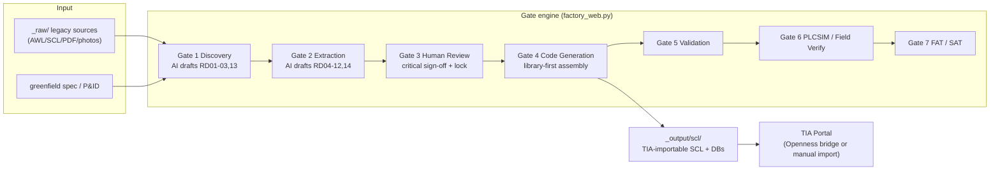

# Architecture

One page for contributors: what runs where, and which design decisions are
load-bearing. (User-facing docs: [README](../README.md) · [INSTALLATION](../INSTALLATION.md).)

## The 30-second picture

## Components

| Component | Where | Role |
|---|---|---|
| Web GUI | `webgui/` (app.js + index.html) | pywebview/WebView2 frontend; talks to Python via `pywebview.api` |
| API / gate engine | `05_SCRIPTS/factory_web.py` | All GUI endpoints, gate rules, project state, audit log |
| AI workflows | `workbench/core/ai_runner.py` | Multi-step, multi-provider workflow runner (discovery, topic extraction, greenfield design) |
| Program assembly | `05_SCRIPTS/program_assembler.py` | **Deterministic** library-first codegen from RD01 — no AI in device logic |
| Block library | `06_KNOWLEDGE_BASE/blocks/` + `contracts/` | Curated FBs, SHA-256 verbatim-copy proof, contract acceptance gate |
| TIA bridges | `05_SCRIPTS/bridges/tia/` | Openness import/compile (V19-V21), PLCSIM-only downloads |
| RAG knowledge base | `05_SCRIPTS/rag/` + `_rag_index/` | Safety-pitfall retrieval (BM25 offline / embeddings), injected as warnings |
| Guards | `data_classification_guard.py`, `anonymizer.py`, `ai_decision_log.py` | Data egress control, PII anonymization, EU-AI-Act audit trail |

## Load-bearing decisions (do not casually undo)

1. **Library-first codegen.** Device logic is *copied verbatim* from curated,
   contract-checked blocks (SHA-256 proven). The only AI-generated SCL is the
   project sequence FB — and it is labelled `DRAFT_UNVERIFIED`.
2. **Human-in-the-loop, risk-based.** Only the critical RDs (RD01 IO list,
   RD03 flowchart, RD05 safety) require explicit review; the Gate-3 lock
   stamps the rest `auto-accepted` — honestly recorded, never silent. RD05
   always needs a **named** sign-off (W-A2). Editing any sealed RD breaks its
   seal (hash-based staleness → auto-unsign).
3. **Two-gear flow.** One-click full analysis (discovery chains into topic
   generation on unreviewed drafts, loudly flagged) for speed; the two-stage
   flow with a review pause stays available for critical projects.
4. **Delta assembly.** `_assembly_manifest.json` (device → RD01 row hash) lets
   *Regenerate affected* rewrite only changed devices. Unchanged files stay
   byte-for-byte; removed devices are reported as orphaned, never deleted.
5. **Data classification gates every AI call.** PUBLIC/INTERNAL/CONFIDENTIAL/
   RESTRICTED decides which providers may see project data; INTERNAL+ is
   anonymized before egress; RESTRICTED blocks all egress. Every AI call is
   audit-logged or refused (`AuditLogError` fails closed).
6. **Honest validation labels.** The built-in SCL validator is structural
   only; anything not TIA-compiled is labelled `PENDING_TIA_VERIFY`. Gate 6
   passes on PLCSIM evidence or a signed manual-test declaration — the gate
   name says so.
7. **Fail-safe defaults everywhere.** Unknown devices land in `#UNKNOWN`
   (never dropped), unknown lifecycle → `DRAFT` warning, failed assembly does
   not move the delta baseline, path access is sandboxed to the project root
   (`_safe()`).

## State & files

- `PROJECT_STATE.json` — gate counter, `rd_verifications` (3-state + N/A),
  gate snapshots, IO-reconciliation acks. Writes serialized by `Api._state_lock`.
- `metadata/RDxx_*.md` — the 14-point pack; frontmatter carries status.
- `_output/scl/` — generated sources + `_assembly_manifest.json`.
- `AI_DECISION_LOG.jsonl` — hash-chained audit of every AI decision.

## Testing

`pytest tests -q` (~1580 tests, Windows+Linux CI matrix). Conventions:
proof tests (fail if the fix is reverted), mocked AI clients, no network.
E2E smoke: `sim/field_pretest.py`. Real-TIA checks are manual
(`05_SCRIPTS/dev/script_send_to_tia_live.py`) — mocks do not catch
Siemens Openness API signature drift.

## Known debt (tracked, post-release)

- `factory_web.py` (~6.4k lines) wants decomposition into
  gui_server / file_manager / ai_gateway / project_manager / rag_bridge.
- `webgui/app.js` (~5k lines) is a single script by design (no build step);
  component split is welcome if it keeps the zero-build property.
- Library device-classification is prefix+keyword based; process-specific
  blocks (`FB_Reaktor`, …) need a per-project extension mechanism.
