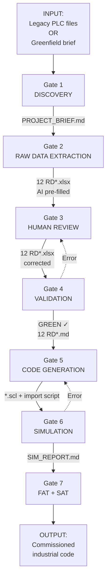

# PIPELINE_CODE_REWRITE.md — Code Rewrite Pipeline

> **This file is the complete map of the flow from "legacy PLC code (or Greenfield brief) → industrial-standard new PLC code."**
>
> FACTORY_MAESTRO.md is the system **backbone** (continuously valid rules). This file is a project's **recipe** (the same 7-gate sequence executed on every project).

---

## 1. What This File Is and Is Not

**This file IS:**
- ✅ An end-to-end flow map for a project (Gate 1 → Gate 7)
- ✅ Input, output, validation, and responsibility definitions for every gate
- ✅ A distinction between "Automatic / Semi-Automatic / Manual"
- ✅ A map of which files to read and which scripts to run

**This file IS NOT:**
- ❌ A replacement for FACTORY_MAESTRO.md (that is the system backbone; this is the recipe)
- ❌ A replacement for RETROFIT_MAESTRO.md / GREENFIELD_MAESTRO.md (those are project-type-specific phases; this pipeline sits above both)
- ❌ An AI prompt (prompts live under `04_AI_PROMPTS/`)

---

## 2. Philosophy — Semi-Automatic, "GREEN Stamp" Discipline

The pipeline performs **two types of work**:

1. **AI work (intelligence):** Reading legacy code, extracting raw data, generating new code
2. **Script work (deterministic):** Format conversion, validation, file management

Humans intervene at **decision points**:
- Adding context the AI missed (operator knowledge, physical risk)
- Scope decisions (is this signal needed? will HMI be requested?)
- Approving gate transitions

**GREEN Stamp rule:** The output of each gate must reach a "GREEN" state before passing to the next gate. GREEN = validation script passed + human approved. Corrupted data **never** passes to the next gate. This is where industrial reliability guarantees come from.

---

## 3. Pipeline Flow (Bird's-Eye View)



---

## 4. Gate 1 — DISCOVERY

### 4.1 Purpose
Establish the project scope, platform, modules to be used, and input artifacts.

### 4.2 Responsibility
**Human + script.** The script (`script_project_init.py`) asks interactive questions; the human provides answers.

### 4.3 Input
- Customer brief (verbal, email, RFQ)
- If available: legacy TIA Portal export, AWL/SCL files, EPLAN PDF, existing HMI project

### 4.4 Flow
```bash
python 05_SCRIPTS/script_project_init.py
```

Script questions:
- Project name? → `<MachineX_Retrofit_2026>`
- Type? → `retrofit` / `greenfield`
- Platform? → `S5 / S7-300 / S7-1500 / AB / CoDeSys`
- HMI present/planned? → `y/N`
- Drives (motion)? → `y/N`
- Safety F-PLC? → `y/N`
- Networked (Profinet/Modbus)? → `y/N`
- Data classification? → `🟢 PUBLIC / 🟡 INTERNAL / 🟠 CONFIDENTIAL / 🔴 RESTRICTED`

### 4.5 Output
- `<project_folder>/PROJECT_MAESTRO.md` — project metadata, factory references
- `<project_folder>/_input/` — legacy code files are placed here
- `<project_folder>/RDXX_*.{xlsx,md}` — only raw data templates matching the scope are copied
- Git init

### 4.6 GREEN Criteria
- [ ] PROJECT_MAESTRO.md created
- [ ] At least 1 file placed in _input/ (retrofit) or brief.md written (greenfield)
- [ ] Data classification stamped
- [ ] Scope (HMI/Drives/Safety/Network) confirmed

### 4.7 Common Issues
- ⚠️ The "legacy code" the customer provided is actually just a PDF — low readability; ask the user to upload AWL/STL files
- ⚠️ Platform information is wrong (what appeared to be S7-300 is actually S7-400) — hardware nameplate photo is mandatory

---

## 5. Gate 2 — RAW DATA EXTRACTION

### 5.1 Purpose
**AI pre-fill** all 12 raw data files. The last human touch point is Gate 3.

### 5.2 Responsibility
**AI (via Cursor).** The script orchestrator invokes AI.

### 5.3 Input
- Legacy code files in the `_input/` folder (retrofit)
- `_input/brief.md` (greenfield)

### 5.4 Flow

#### 5.4.1 Retrofit (extract from legacy code)

**Step A — Platform parser:** First, identify the code format.

| Platform | Prompt |
|---|---|
| Siemens S5 | `04_AI_PROMPTS/analyze/PROMPT_ANALYZE_S5_AWL.md` |
| Siemens S7-300/400 | `04_AI_PROMPTS/analyze/PROMPT_ANALYZE_S7_300_STL.md` |
| Siemens S7-1500 (TIA V14+) | `04_AI_PROMPTS/analyze/PROMPT_ANALYZE_S7_1500_OPENNESS.md` |
| Allen-Bradley | `04_AI_PROMPTS/analyze/PROMPT_ANALYZE_AB_L5X.md` |
| CoDeSys | `04_AI_PROMPTS/analyze/PROMPT_ANALYZE_CODESYS.md` |

In Cursor:
> "Read the `<platform_prompt>` from the factory. Analyze the code in the `_input/` folder. Write your findings to `_input/_parsed.md`."

**Step B — Topic extractor:** Fill the 12 raw data files in sequence from the parsed output.

| # | Extractor Prompt | Output file |
|---|---|---|
| 01 | `PROMPT_EXTRACT_IO_FROM_CODE.md` | `RD01_IO_List.xlsx` |
| 02 | `PROMPT_EXTRACT_DATADICT_FROM_CODE.md` | `RD02_Data_Dictionary.xlsx` |
| 03 | `PROMPT_EXTRACT_FLOWCHART_FROM_CODE.md` | `RD03_Flow_Diagrams.md` |
| 04 | `PROMPT_EXTRACT_MODE_FROM_CODE.md` | `RD04_Mode_Diagram.md` |
| 05 | `PROMPT_EXTRACT_SAFETY_FROM_CODE.md` | `RD05_Safety_Matrix.xlsx` |
| 06 | `PROMPT_EXTRACT_MOTION_FROM_CODE.md` | `RD06_Motion_Profiles.xlsx` |
| 07 | `PROMPT_EXTRACT_TIMING_FROM_CODE.md` | `RD07_Timing.xlsx` |
| 08 | `PROMPT_EXTRACT_ALARM_FROM_CODE.md` | `RD08_Alarm_List.xlsx` |
| 09 | `PROMPT_EXTRACT_COMMS_FROM_CODE.md` | `RD09_Comms_Matrix.xlsx` |
| 10 | `PROMPT_EXTRACT_FBSPEC_FROM_CODE.md` | `RD10_FB_FC_Spec.md` |
| 11 | `PROMPT_EXTRACT_HMI_FROM_CODE.md` | `RD11_HMI_Signals.xlsx` |
| 12 | `PROMPT_EXTRACT_USECASE_FROM_CODE.md` | `RD12_Operation_Scenarios.md` |

Items not in scope are skipped (e.g. if HMI=N was set in Gate 1, item 11 is skipped).

#### 5.4.2 Greenfield (design from scratch)

AI-assisted pre-design guided by `02_PROJECT_TYPES/GREENFIELD/GREENFIELD_DESIGN_*.md`. Human knowledge comes from the Gate 1 brief.

### 5.5 Output
- 12 (or fewer, depending on scope) `RDXX_*.xlsx` / `.md` files — AI pre-filled

### 5.6 GREEN Criteria
- [ ] All in-scope RD files produced
- [ ] No empty files (at least one row of content in each)
- [ ] No "TODO" / "I don't know" / "?" in AI output (if present, human fills in Gate 3)

### 5.7 Common Issues
- ⚠️ AI misinterprets symbol labels (e.g. `E_Teil_vor_Vereinzelner` → "Englishified" incorrectly) → each platform prompt has a comment-preservation rule; verify it is applied
- ⚠️ DB content comes from XML but AI skips some UDTs → the cross-reference script double-checks

---

## 6. Gate 3 — HUMAN REVIEW

### 6.1 Purpose
Apply all corrections to the AI-extracted data that require **human judgment**. The lifeblood of the pipeline.

### 6.2 Responsibility
**Human (engineer + operator).** AI is out of the loop in this step.

### 6.3 Input
- Gate 2 output: 12 pre-filled RD files

### 6.4 Flow

Open each file in Excel in sequence:

1. **Correct signal labels:** AI may have written "sensor" when the correct label is "encoder"
2. **Fill the `Status` column:** Active / Inactive / Spare — Inactive items are not carried over to Markdown
3. **Add operator knowledge:** "This door is tied to emergency stop; AI did not see this"
4. **Complete missing context:** Fix nonsensical transitions in the Mermaid flow
5. **Review scope decision:** Are you satisfied with 7 out of the 8 files in the pipeline?

### 6.5 Output
- 12 (or fewer) `RDXX_*.xlsx` — cleaned by a human

### 6.6 GREEN Criteria
- [ ] All `Status` columns filled
- [ ] `Description` is non-empty for every row
- [ ] Transition arrows in Mermaid diagrams have **conditions** written on them
- [ ] Operator validation obtained (mandatory for retrofit)

### 6.7 Common Issues
- ⚠️ If only an engineer reviews without an operator, "why was it done this way?" goes unanswered — operator validation is MANDATORY for RETROFIT
- ⚠️ If `Status` is left blank in Excel, filtering breaks — the script catches this in Gate 4

---

## 7. Gate 4 — VALIDATION

### 7.1 Purpose
Verify all machine-verifiable properties of the data with scripts. This is where the real "GREEN stamp" is issued.

### 7.2 Responsibility
**Script.** Human only returns to Gate 3 if errors are found.

### 7.3 Input
- Gate 3 output: 12 cleaned RD files

### 7.4 Flow

```bash
python 05_SCRIPTS/dev/script_consistency_check.py
python 05_SCRIPTS/dev/script_excel_to_metadata.py
python 05_SCRIPTS/dev/script_md_schema_validator.py
```

Items checked:
- ✅ Naming standard compliance (`GLOBAL_NAMING_STANDARD.md`)
- ✅ Required fields filled (validated against JSON schemas)
- ✅ Enum values valid (e.g. type = one of `BOOL/INT/REAL`)
- ✅ Regex compliance (e.g. tag = `^[A-Z]+_[A-Z0-9]+_\d{3}(_[A-Z]+)?$`)
- ✅ Cross-reference consistency (is the tag in RD01 defined in RD02?)
- ✅ Mermaid syntax (no parse errors)

### 7.5 Output
- 12 (or scope-limited) `RDXX_*.md` files — Active-filtered, in a format ready to feed to AI
- `_VALIDATION_REPORT.md` — pass/fail summary

### 7.6 GREEN Criteria
- [ ] script_consistency_check exits 0
- [ ] script_md_schema_validator exits 0
- [ ] 0 failures in _VALIDATION_REPORT.md

### 7.7 Common Issues
- ⚠️ Lowercase in tag name (e.g. `mot_pump_01`) — naming rejects it; reason: standard accepts only UPPERCASE_SNAKE_CASE
- ⚠️ Semicolon instead of comma in Mermaid — parse error

---

## 8. Gate 5 — CODE GENERATION

### 8.1 Purpose
Read the 12 GREEN-stamped raw data files and generate industrial-standard SCL code.

### 8.2 Responsibility
**AI (via Cursor) + human approval (for every FB diff).**

### 8.3 Input
- 12 validated `RDXX_*.md` files
- Prompts under `04_AI_PROMPTS/code_gen/`

### 8.4 Flow

In Cursor:
> "Read the 12 raw data MD files. Using the prompts in `04_AI_PROMPTS/code_gen/`, generate the following artifacts in sequence:
> - RD01 + RD06 → the appropriate motor prompt for each motor (`PROMPT_MOTOR_DOL/VFD/STAR_DELTA/...`)
> - RD01 → `PROMPT_CODE_GEN_FB_VALVE.md` for each valve
> - RD03 + RD04 → `PROMPT_CODE_GEN_SEQUENCE.md` for the main sequence
> - RD08 → alarm management
> - RD11 → HMI screen skeletons (if in scope)
>
> Write the output to the `_output/` folder: `FB1_MotorPump.scl`, `FB2_ValveInlet.scl`, `OB1_Main.scl`, ...
> Every file must conform to the `GLOBAL_FB_TEMPLATE.scl` structure."

AI generates sequentially. **Cursor diff approval is mandatory for each FB** — you accept or reject each change.

### 8.5 Output
- `_output/*.scl` files
- `_output/import.xml` — for TIA Portal Openness import
- `_output/_GEN_LOG.md` — which prompt generated which file

### 8.6 GREEN Criteria
- [ ] All FBs in `GLOBAL_FB_TEMPLATE.scl` 4-region structure
- [ ] All tags back-referenced to RD01 (no orphan tags)
- [ ] Final scan done with `PROMPT_REVIEW_NAMING.md`
- [ ] Human diff approval given for every FB

### 8.7 Common Issues
- ⚠️ AI writes comments in Turkish/German — the prompt has an "English comments" requirement; if missed, `PROMPT_REVIEW_NAMING.md` catches it
- ⚠️ AI writes level-triggered reset instead of rising-edge — violation of `GLOBAL_FB_TEMPLATE.scl`

---

## 9. Gate 6 — SIMULATION

### 9.1 Purpose
Run the code in TIA Portal PLCSIM Advanced or equivalent, and verify behavior before going to the field.

### 9.2 Responsibility
**Human + PLCSIM. AI assists.**

### 9.3 Input
- Gate 5 output: SCL + import.xml

### 9.4 Flow
1. Import into TIA Portal (manual — via Siemens Openness)
2. Compile — zero errors required
3. Load into PLCSIM Advanced
4. Process simulation guided by `DOMAIN_SIMULATION_PROCESS_MODEL.md`
5. Run scenarios from the RD04 mode diagram
6. Validate RD12 use-cases one by one

### 9.5 Output
- `_output/SIM_REPORT.md` — passed/failed scenarios
- If corrections needed, return to Gate 5

### 9.6 GREEN Criteria
- [ ] Compile clean (0 errors, 0 warnings or justified warnings)
- [ ] All use-cases passed in simulation
- [ ] Alarm triggers compliant with RD08

---

## 10. Gate 7 — FAT + SAT

### 10.1 Purpose
Factory and site acceptance testing. Closed with customer signature.

### 10.2 Responsibility
**Human (test engineer + customer).** Existing documents provide guidance.

### 10.3 Flow
- FAT conducted per `DOMAIN_TESTING_FAT.md`
- Commissioning: `RETROFIT_MAESTRO.md` § 6.2 or `GREENFIELD_MAESTRO.md` (future) § equivalent
- SAT conducted per `DOMAIN_TESTING_SAT.md`

### 10.4 Output
- Signed FAT report
- Signed SAT report
- As-built documentation

### 10.5 GREEN Criteria (= Project Closure)
- [ ] Customer-signed acceptance
- [ ] At least 1 feedback item sent to factory (mandatory — `script_propose_update.py`)
- [ ] Project experience added to `06_KNOWLEDGE_BASE/KB_FEEDBACK_LOG.md`

---

## 11. Responsibility Matrix (RACI Summary)

| Gate | AI | Script | Human |
|------|----|--------|-------|
| 1 DISCOVERY | — | R | A (provides answers) |
| 2 EXTRACTION | **R** | C (orchestrator) | I (monitors) |
| 3 REVIEW | — | C | **R+A** |
| 4 VALIDATION | — | **R** | A (if errors) |
| 5 CODE GEN | **R** | C (export) | A (diff approval) |
| 6 SIMULATION | C (analysis) | C | **R+A** |
| 7 FAT/SAT | — | — | **R+A** |

R=Responsible, A=Accountable, C=Consulted, I=Informed

---

## 12. Scope-Driven Skeleton — Which Gate Produces Which Files?

The scope set in Gate 1 determines which files the pipeline works with.

| Scope answer | Affected RD files |
|---|---|
| HMI=N | RD11 skipped |
| Drives=N | RD06 skipped (no motion profile) |
| Safety=N | RD05 skipped (no safety matrix) |
| Network=N | RD09 skipped |
| `applies_to=greenfield` | Greenfield-design guides used instead of retrofit-extract prompts |

`script_project_init.py` applies this decision automatically: only template files matching the scope are copied to the project folder.

---

## 13. Automatic / Semi-Automatic / Manual Summary

| Work | Type | Estimated time (mid-size project) |
|----|------|---------------------------|
| Gate 1 query | Semi-Automatic | 5 min |
| Gate 2 AI analysis | Semi-Automatic | 10–30 min |
| Gate 3 human review | **Manual** | 1–4 hours |
| Gate 4 validation | **Automatic** | <1 min |
| Gate 5 AI code generation | Semi-Automatic | 15–60 min |
| Gate 5 diff approval | **Manual** | 30–90 min |
| Gate 6 simulation | **Manual** | 1–3 days |
| Gate 7 FAT/SAT | **Manual** | Weeks |

**Result:** Pipeline is ~60% AI/script, ~40% human. Industrial reliability ✓ — efficiency ↑ trade-off.

---

## 14. v1.5 GUI Vision (Future)

Same 7 gates, in a browser via Streamlit:
- File pickers
- Checkboxes (scope)
- "Start Analysis", "Validate", "Generate Code", "Export" buttons
- Progress bars
- Gate-by-gate "GREEN/RED" indicators

The underlying scripts and AI prompts remain unchanged. The GUI is just a shell. Target: v1.5.

---

## 15. Related Files

- **Backbone:** `FACTORY_MAESTRO.md`
- **Project-type recipes:** `02_PROJECT_TYPES/RETROFIT/RETROFIT_MAESTRO.md`, `02_PROJECT_TYPES/GREENFIELD/GREENFIELD_MAESTRO.md`
- **Raw data specs:** `01_GLOBAL_STANDARDS/md_schemas/MDSCHEMA_RAWDATA_*.md`
- **Analysis prompts:** `04_AI_PROMPTS/analyze/PROMPT_ANALYZE_*.md`, `PROMPT_EXTRACT_*_FROM_CODE.md`
- **Code generation prompts:** `04_AI_PROMPTS/code_gen/`
- **Per-project skeleton:** `07_PROJECT_TEMPLATE/metadata_template/`
- **Validation schemas:** `08_METADATA_INPUT/schema/`
- **Scripts:** `05_SCRIPTS/script_project_init.py`, `script_consistency_check.py`, `script_excel_to_metadata.py`, `script_md_schema_validator.py`, `script_openness_export.py`

---

## 16. Feedback

```bash
python 05_SCRIPTS/script_propose_update.py \
  --target "PIPELINE_CODE_REWRITE.md" \
  --reason "..." \
  --suggestion "..."
```

---

*v1.0.0 — Written alongside the v3.0.0 expansion. If the user discovers a new requirement in any of this pipeline's gates, the relevant gate section is updated and the version is incremented.*
