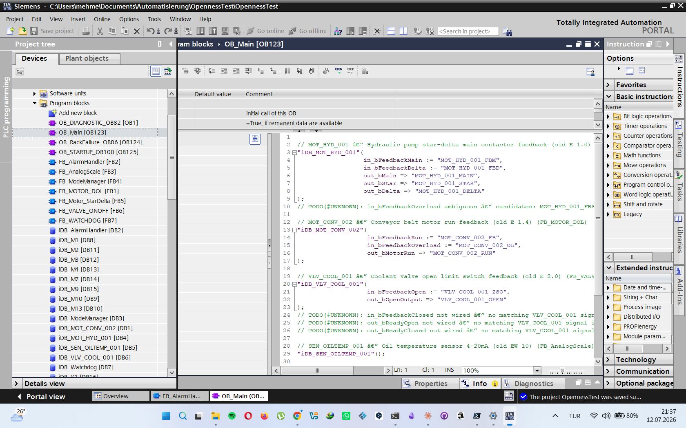

# AUTOMATION_FACTORY — Showcase

> One page, evidence only. Every claim below links to something you can
> re-run or read in this repository. For the philosophy see the
> ["honest note" in the README](../README.md#-honest-note--what-this-is-and-isnt);
> for the how-to see the [Retrofit User Guide](USER_GUIDE_RETROFIT.md).

## What it is, in one paragraph

An AI-assisted framework that turns **legacy PLC code** (Siemens S5/S7 exports,
PDF listings) or a **greenfield brief** into a reviewed, signed, auditable
**TIA Portal (S7-1500) SCL program** — through a 7-gate flow where the AI
drafts, a **deterministic layer proves or refuses**, and the engineer signs
what matters. It is a validated core built by an automation engineer directing
AI tools, not a shipped product — and it says so.


## Proof points (re-runnable)

| Claim | Evidence |
|---|---|
| **1662 automated tests, green** | `python -m pytest` — count re-verified 2026-07-06 |
| **18/18 library blocks import + compile in a real TIA Portal V19** | first full live Openness run 2026-07-06 (headless, `05_SCRIPTS/nightly_tia_check.py`); two library defects found by that run were fixed the same day (UDT ordering, VERSION format) |
| **Blind test on a real, undocumented legacy machine** (~300 IO) | produced a TIA project that compiled with **0 errors** + a full 14-document pack |
| **The extraction proves itself** | legacy bit-logic replayed on **128 random vectors** per network; 230/261 networks proven, the remaining 31 are **listed as unsolved** instead of guessed |
| **Refuses instead of hallucinating** | unknown signals stay marked `❓`; SIL/PLr is never estimated (`DRAFT_UNVERIFIED`); uncertain blocks are skipped **fail-closed** at TIA import; downloads refuse any target not verified as PLCSIM |
| **Deterministic code assembly** | Gate-4 SCL comes from the curated block library (`06_KNOWLEDGE_BASE/blocks/` + contracts + acceptance gate), not from free-form AI output |

## What the engineer keeps (by design)

Safety logic (RD05) is drafted but **never** auto-approved — a named engineer
signs. Gate-3 is a bulk sign-off: *"I read it, I understood it, generate."*
FAT/SAT protocols, SISTEMA and CE documents are generated as **drafts with
honest labels** (`AUTO_VERIFIED_structural | PENDING_TIA_VERIFY`).



## Try it in 10 minutes (no license, no AI key)

```bash
git clone https://github.com/Mehmet-Haydar/automation-factory.git
cd automation-factory
install.bat   # once — creates .venv
start.bat     # opens the Workbench GUI
```

Then open the bundled example **`examples/Demo_Beispielmaschine_4711/`**
(anonymized S5 sources in `_raw/legacy_code/`, generated SCL in
`_output/scl/`) — or read
[`examples/Kunde_Mueller_Conveyor_Retrofit/`](../examples/Kunde_Mueller_Conveyor_Retrofit/README.md)
for the full 14-point Raw Data Pack of a small conveyor retrofit.

## What it is NOT (yet)

- Not proven beyond **one** real machine family — it needs more field runs.
- No offline/local-model mode — cloud AI APIs required for the analysis steps.
- S7-300/400 classic targets are out of scope; PLCSIM live run still pending
  engineer verification (`PENDING_TIA_VERIFY` labels stay until then).
- Visual layer (GRAFCET diagrams, decision tables, C&E matrix) is in
  development — tracked as GÖRSEL PAKET v2.

*Updated 2026-07-06 — after the first full live TIA Openness verification run.*
