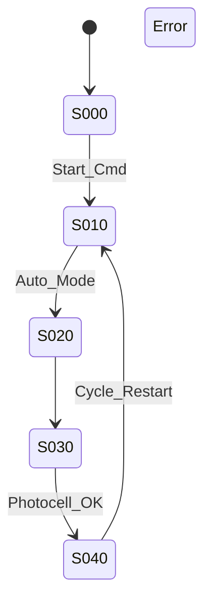

# RD03_Flowchart — Kunde Müller (placeholder, awaiting operator workshop)

```yaml
status: DRAFT (20%)
workshop_pending: 2026-05-25
```

## Summary (draft)
- AI draft step list: S000, S010, S020, S030, S040, S099
- Will be detailed after the operator workshop

## Steps Detected (AI)

| StepID | StepName | StepType | Description | ModeReq | Status |
|--------|----------|----------|-------------|---------|--------|
| S000 | Initial | Initial | Initial state / reset | ALL | DRAFT |
| S010 | Wait_Start | Normal | Wait for start command | M01 | DRAFT |
| S020 | Convey_Item | Normal | Run the conveyor | M01 | DRAFT |
| S030 | Photocell_Wait | Normal | Wait for photocell detection | M01 | DRAFT |
| S040 | Pack_Complete | Normal | Production complete | M01 | DRAFT |
| S099 | Error_Recovery | Final | Error state | ALL | DRAFT |



*Detailed fill-in after the operator workshop (2026-05-25).*
