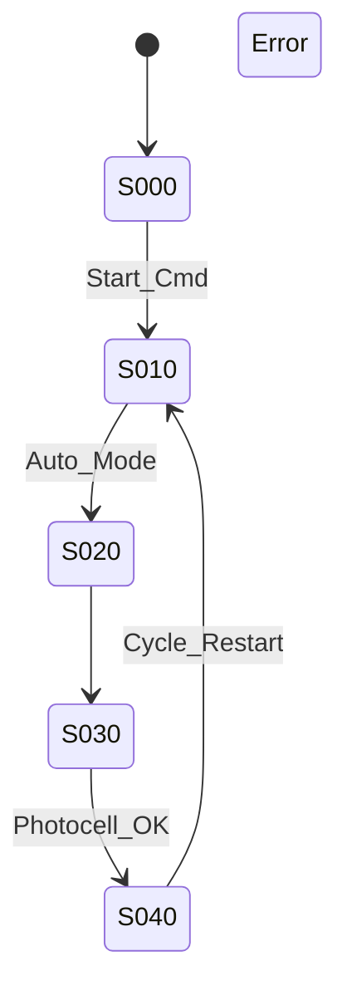

# RD03_Flowchart — Kunde Müller (placeholder, operator workshop bekliyor)

```yaml
status: DRAFT (20%)
workshop_pending: 2026-05-25
```

## Özet (taslak)
- AI taslak step listesi: S000, S010, S020, S030, S040, S099
- Operator workshop sonrası detaylanacak

## Tespit Edilen Step'ler (AI)

| StepID | StepName | StepType | Description | ModeReq | Status |
|--------|----------|----------|-------------|---------|--------|
| S000 | Initial | Initial | İlk durum / reset | ALL | DRAFT |
| S010 | Wait_Start | Normal | Start komutu bekle | M01 | DRAFT |
| S020 | Convey_Item | Normal | Konveyörü çalıştır | M01 | DRAFT |
| S030 | Photocell_Wait | Normal | Photocell algılaması bekle | M01 | DRAFT |
| S040 | Pack_Complete | Normal | Üretim tamamlandı | M01 | DRAFT |
| S099 | Error_Recovery | Final | Hata durumu | ALL | DRAFT |



*Detaylı doldurma operatör workshop sonrası (2026-05-25).*
